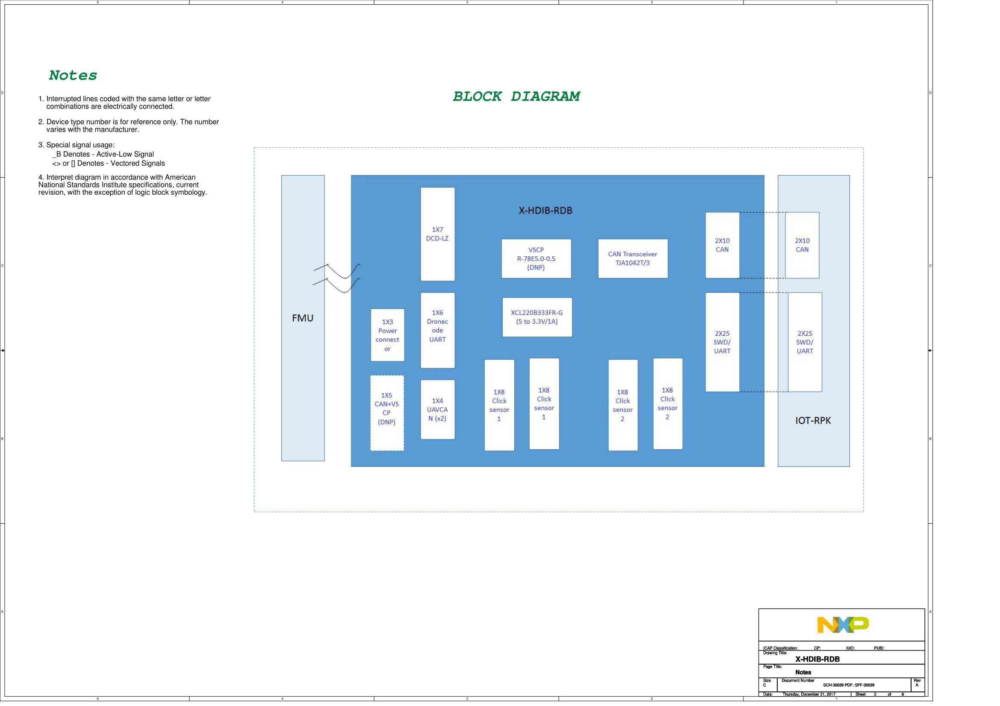
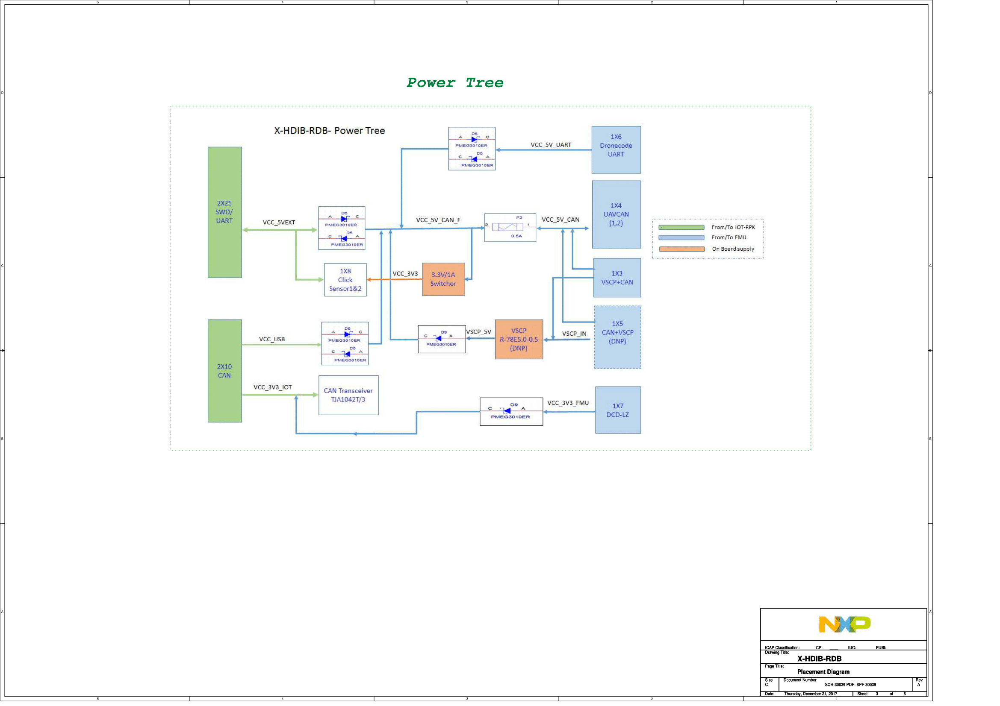
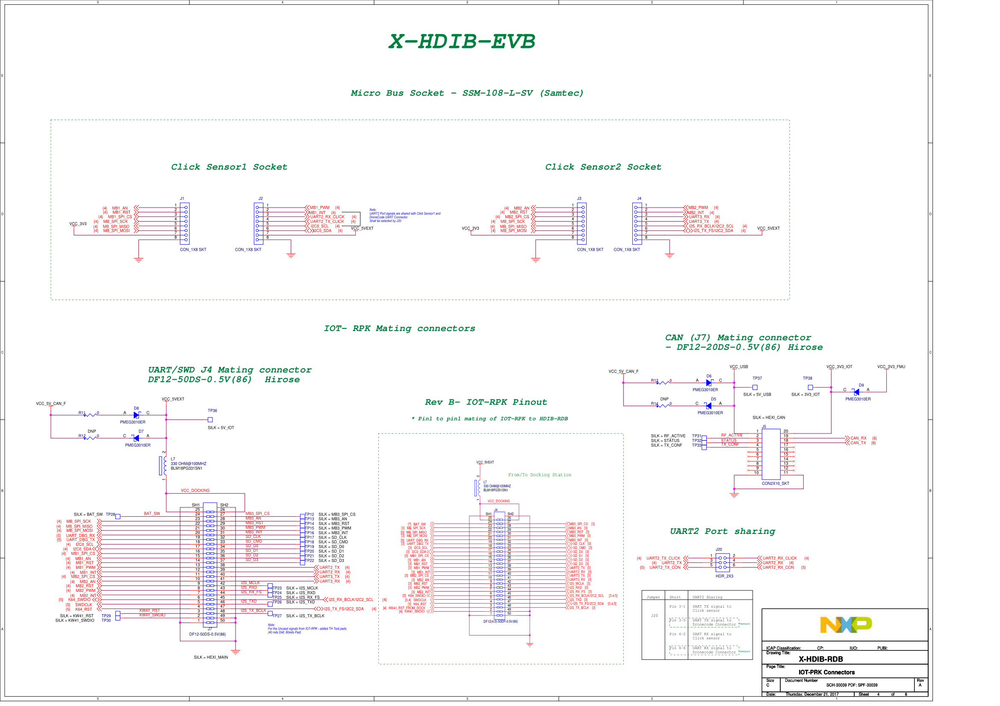
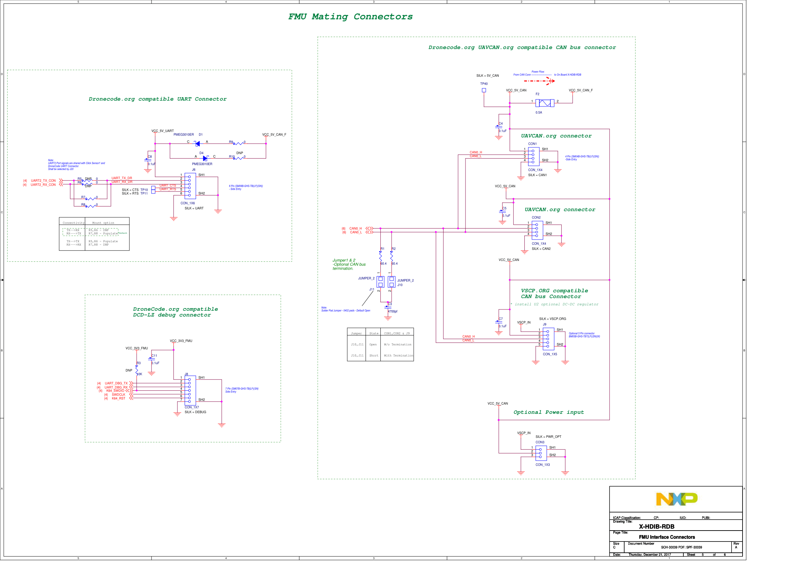
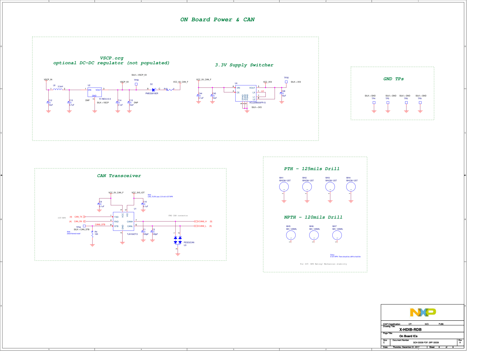

# RDDRONE-IOT "HDIB" adapter board

## Description

The RDDRONE-IOT or  "HDIB board" \(**H**overGames **D**rone **I**oT Adapter **B**oard\) is an experimental adapter board that allows the NXP [RAPID-IOT ](https://www.nxp.com/rapid-iot)board to connect to the  RDDRONE-FMUK66, NXPhlite or another PX4 type FMU using Standard JST GH Connectors. It will accommodate two mikroelectronica CLIK modules, and has both CANBUS and UART connections to the outside world. An NXPhlite DCD-LZ debug port is provided at the bottom of the board which provides SWD debug as well as a UART console port. It will also accept a separate 3V or 5V custom power input ans well as the 6 pin JST-GH power brick input from a PX4-type power module.


The HDIB **can also** be configured to work with  [VSCP.org](https://www.vscp.org). VSCP stands for Very Simple Control Protocol and is typically implemented on a CAN Based IOT devices. To enable this a 3 pin DC-DC regulator needs to be soldered onto the HDIB board.

The RapidIOT would make for an excellent VSCP node, or bridge between CAN and Thread wireless networking.


## Purpose

The HDIB allows for several use cases combining a drone or rover and IoT, in other words "mobile IoT". Some examples are:

* Peripheral to the drone
  * MAVLINK UART connected sensor \(UV Light, Gas, pressure, radiation\)
  * UAVCAN CAN connected generic node reference 
  * LCD display of drone data
  * configuration settings input 
  * NFC tag reader
  * Bluetooth BLE peripheral 
  * Thread 802.15.4 IPV6/6LowPan mesh network radio
* Controller of the drone
  * Use SDK to control drone operation
  * Use drone to get 3D position information for mapping point clouds of data
    * UV light map, C02 gas, Radiation detector in 3D point cloud resulting in a map or vector to source.
    * Map a workplace for light and oxygen levels.
* Parallel operation / Payload
  * Ground based device for landing or sensing 
    * Use BLE or Thread or IR

## Configuration Notes

The HDIB is meant to be highly configurable, particularly in terms of power supply or power flow. there are several diodes and optional resistors used to steer power. Please check your particular board to ensure that the components are set correctly.

## Schematics

