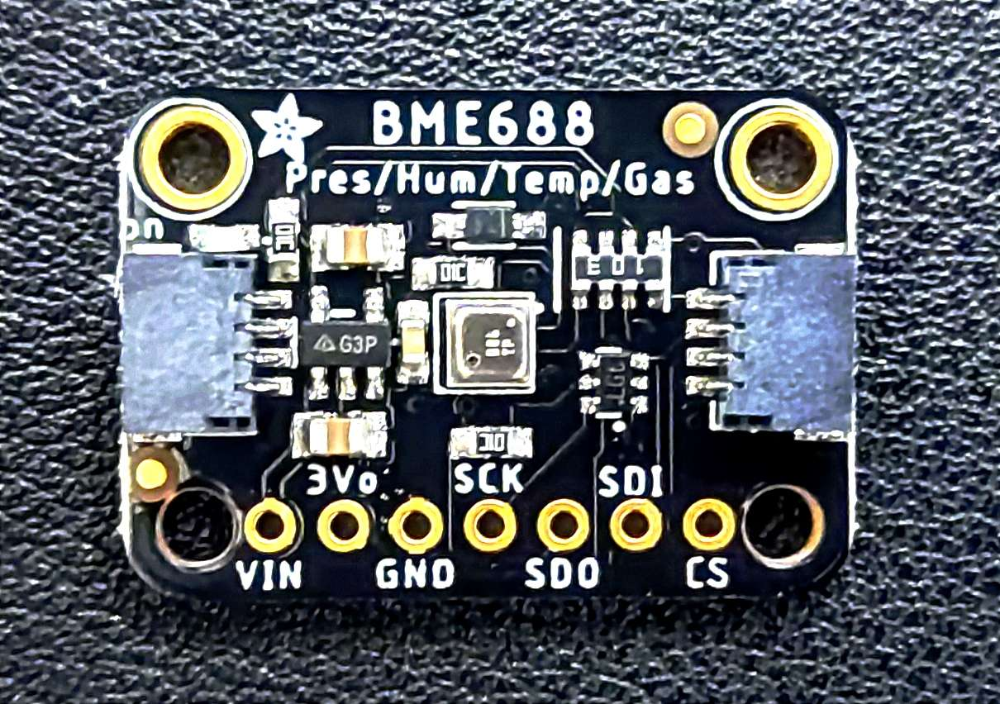
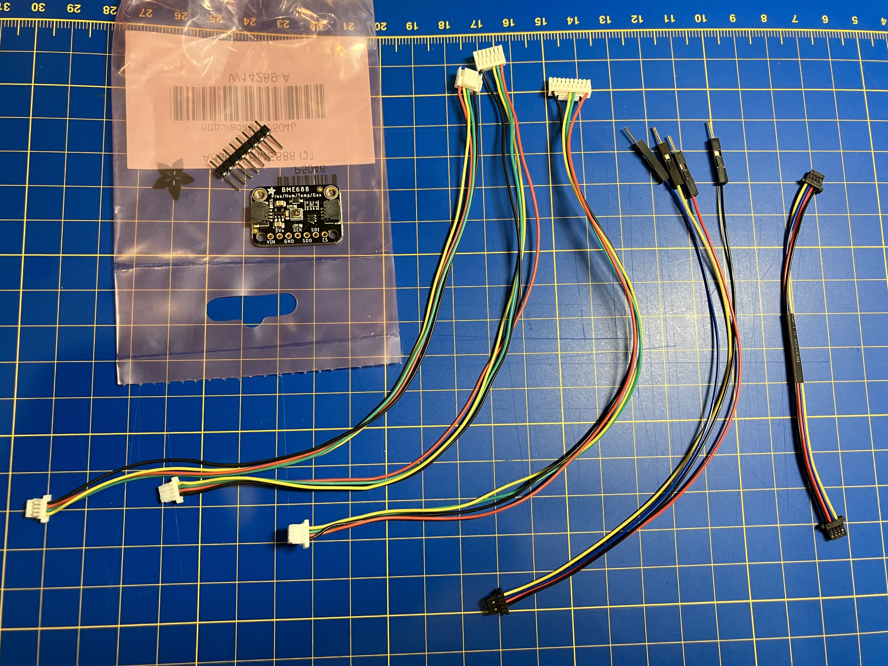
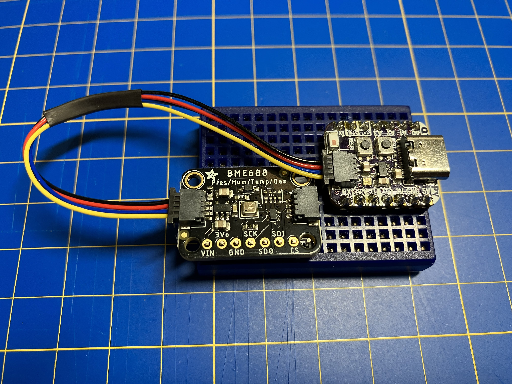
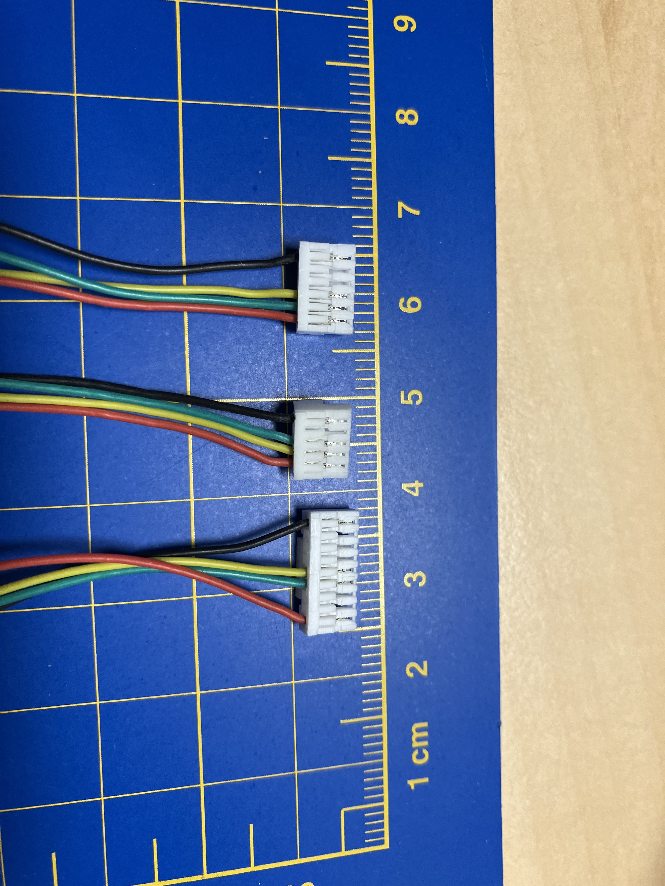

# Bosch Sensortec BME688

## Introduction

HoverGames3 includes Bosch Sensortec as a partner. They contributed their BME688 Environmental sensor as installed on the Adafruit BME688 module. It should also be noted that the [Bosch Sensortech BMI088 inertial sensor](https://www.bosch-sensortec.com/products/motion-sensors/imus/bmi088/) is also used on the FMUK66.

\
More information on the BME688 sensor can be found on their webpage here:\
[https://www.bosch-sensortec.com/products/environmental-sensors/gas-sensors/bme688/](https://www.bosch-sensortec.com/products/environmental-sensors/gas-sensors/bme688/)



This version of the environmental (gas) sensor is pin compatible with the BME680, but with AI built in! From the sensortec website they state _"The BME688 is the first gas sensor with Artificial Intelligence (AI) and integrated high-linearity and high-accuracy pressure, humidity and temperature sensors."_\

<figure><figcaption>
Adafruit board with Bosch Sensortec BME688
</figcaption></figure>

## Connections

<figure><figcaption>
Adafruit board and custom cables provided to HoverGames3 participants
</figcaption></figure>

#### I2C

The [Adafruit BME688](https://www.adafruit.com/product/5046) module has two "STEMMA QT" JST SH 4 pin sockets (Also called Qwiic/ Sparkfun QT) for I2C access to the sensor.

#### SPI If you want to use SPI there are also pads available to solder your own direct connection. Alterantively use the included common 0.100" pin-header to make it breadboard compatible

### Cables included with Hover Games 3 Sensor kit

1. Stemma QT to Qwiic (Used by Adafruit and Sparkfun breakout boards)
2. Qwiic to open pins (useful for breadboards or some microcontrollers with sockets)
3. Qwiic to FMUK66 (JST-GH 5 pin I2C/NFC interface)
4. Qwiic to NavQ (JST-GH 9 pin UART4/I2C/GPIO interface)
5. Qwiic to NavQPlus  (JST-GH 6 pin AUX interface)

<figure><figcaption>
Example of BME688 used on a breadboard and/or connected to an Adafruit breakout board (not included)
</figcaption></figure>

<figure><figcaption>
Custom JST-GH cables for connecting to FMUK66/NAVQ/NAVQPLUS
</figcaption></figure>

## Resources

* [Introduction to BME688 and AI-Studio on Youtube](https://youtu.be/4vdliMRtxBY)
* [Adafruit item page](https://www.adafruit.com/product/5046)
* [Adafruit Learn guide for the BME680](https://learn.adafruit.com/adafruit-bme680-humidity-temperature-barometic-pressure-voc-gas) Doesn't cover the new Bosch BME AI-Studio
* [Bosch BME688 datasheet](https://www.bosch-sensortec.com/media/boschsensortec/downloads/datasheets/bst-bme688-ds000.pdf)
* [Bosch BME AI-Sudio](https://www.bosch-sensortec.com/software-tools/software/bme688-software/)
* [Bosch Github repository](https://github.com/BoschSensortec)
* 3D printable enclosures:
  *   [https://www.thingiverse.com/thing:5722287](https://www.thingiverse.com/thing:5722287)

      <figure><figcaption></figcaption></figure>
  *   [https://www.thingiverse.com/thing:5143210](https://www.thingiverse.com/thing:5143210)&#x20;

      <figure><figcaption></figcaption></figure>
