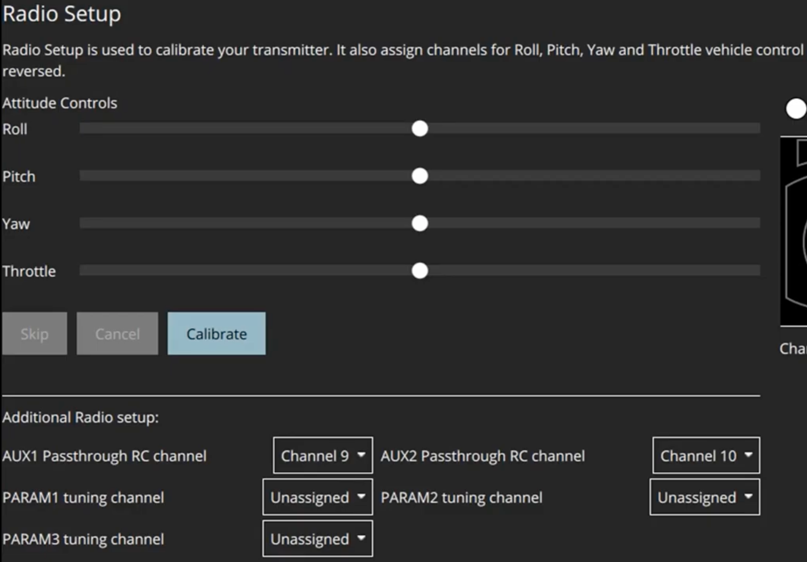

# NavQ Camera Servo Mount

## Video Guide

This video is from **Andrew Brahim** on YouTube. The written guide below is an overview of what he does in the video.



## Guide

### Materials

You can purchase a servo turret like the one linked below:



You will also want an UBEC that will power the +5V rail on the PWM channels:



You can mount the Pan/Tilt mount wherever you want on your drone. You may be limited in range by the length of the MIPI CSI cable that comes connected to the Google Coral Camera on the NavQ. You can purchase a longer cable from here:



### Hardware setup

The UBEC needs to be supplied power from the included power distribution board - you can solder the +/- wires to any of the leads on the board.


This image is from the NXP Cup Gitbook, so just use this as an example. Your Power Distribution Board will have bullet connectors on it.


.png>)

Mount the Pan/Tilt mount anywhere you'd like on your drone. Plug each servo into the #5 and #6 PWM channels on the FMU, and plug the UBEC into the BEC port.&#x20;


Make sure that your UBEC is set to 5V.


.png>)

### Setup in QGroundControl

These are the settings you will want to use in QGroundControl to control the servos.

.png>)

.png>)

.png>)

.png>)

