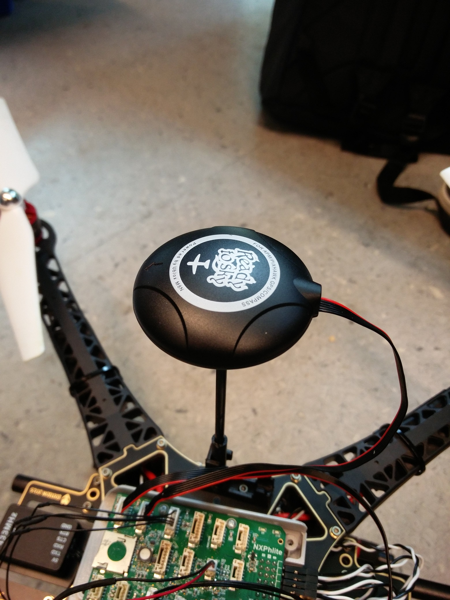
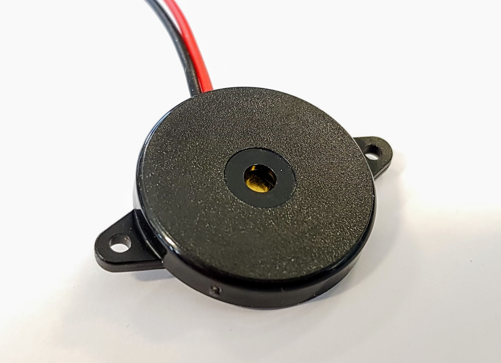

# Replaced drone kit items


This page is **archived**. You are probably looking for the page that lists the [drone kit contents](../userguide/getting-started/drone-kit-contents.md).


Some components were included in older kits and were either replaced or left out.

* 1x [ReadytoSky S500 quadcopter frame kit with carbon fiber landing gear](../userguide/getting-started/drone-kit-contents.md#readytosky-s500-quadcopter-frame-kit-with-carbon-fiber-landing-gear) (old kits)
* 1x [Generic SiK 433 MHz/915 MHz telemetry radio transceiver set](../userguide/getting-started/drone-kit-contents.md#sik-433-mhz-915-mhz-telemetry-radio-transceiver-set)
* 1x [ReadytoSky u-blox NEO-M8N GPS module](../userguide/getting-started/drone-kit-contents.md#readytosky-u-blox-neo-m-8-n-gps-module-and-gps-mount)
* 1x [Generic safety switch](../userguide/getting-started/drone-kit-contents.md#safety-switch)
* 1x [Generic buzzer](../userguide/getting-started/drone-kit-contents.md#buzzer)
* 2x Generic XT60 connector (a male and a female connector)
* 1x Hobbywing 2-6S 5V/3A UBEC


(Older) video showing the contents of the HoverGames kit. \[OUTDATED]


## ReadytoSky S500 quadcopter frame kit with carbon fiber landing gear

[Product webpage](http://www.readytosky.com/e\_productshow/?422-Readytosky-S500-Quadcopter-Frame-Kit-with-Carbon-Fiber-Landing-Gear-422.html)

The S500 quadcopter frame was part of some old HoverGames kits. Its bottom plate also functions as a PDB (power distribution board); the power cables for most component can be soldered directly to the soldering pads on the board.

* Frame size: 480 mm (diagonal), 170 mm (height)
* Weight: 405 g (without electronics and motors)

## SiK 433 MHz/915 MHz telemetry radio transceiver set

A set of these telemetry radios were included in older drone kits. This allows you to change settings and parameters in PX4 without USB. It also allows you to check the status of the drone while it is in the air. One radio connects directly to the FMU. The other radio can be plugged into your computer.


In Europe radios with a frequency of 433 MHz should be used. For the USA this should be 915 MHz. This has to do with the differences in frequency allocation by the government.



Do not upgrade the firmware on these radios! If you do an upgrade on one, you will have the other side as well, which is not easy to do, because it has no USB connection. They should work just fine with their default firmware.


## ReadytoSky u-blox NEO-M8N GPS module and GPS mount

[GPS product webpage](http://www.readytosky.com/e\_productshow/?527-Readytosky-Ublox-NEO-M8N-GPS--For-APM-and-Pixhawk-Flight-Controller-527.html)\
[Mount product webpage](http://www.readytosky.com/e\_productshow/?955-Plastic-GPS-Antenna-Foldable-Mount-Holder-955.html)

This GPS module was included in old kits. GPS allows the drone to receive information about its position. This enables position hold mode and autonomous flying modes in which no user input is required. It plugs directly into the FMU. It also includes a compass, which is able to measure the rotation of the drone.


Current revisions of the RDDRONE-FMUK66 have issues with their internal compass. For this reason, the internal compass is completely disabled in the firmware by default. Therefore, a plugged in GPS module with external compass is required to fly, even when the GPS signal is not used.


The drone kit also includes an elevated mount for the GPS module, which limits the interference from the electronics and motors. A small, curved 3D printed piece is included in the kit, which can be used to mount the base on the top plate of the frame.

## Safety switch

A seperate safety switch was included in older drone kits. The safety switch connects directly to the FMU. It is an extra safety feature which only allows the drone to fly when the switch is activated. A LED indicates whether the drone is armed. A slow pulse indicates disarmed. A quick pulse indicates that the switch is activated, but the remote controller is still disarmed. A constant glow indicates that the drone is fully armed and ready for take-off.

## Buzzer

A buzzer was also included in older drone kits. It can be connected directly to the FMU and allows for audio feedback from the flight controller. It lets you know when there are warnings or errors, such as problems with sensor calibration or when the battery level becomes low during flight.

