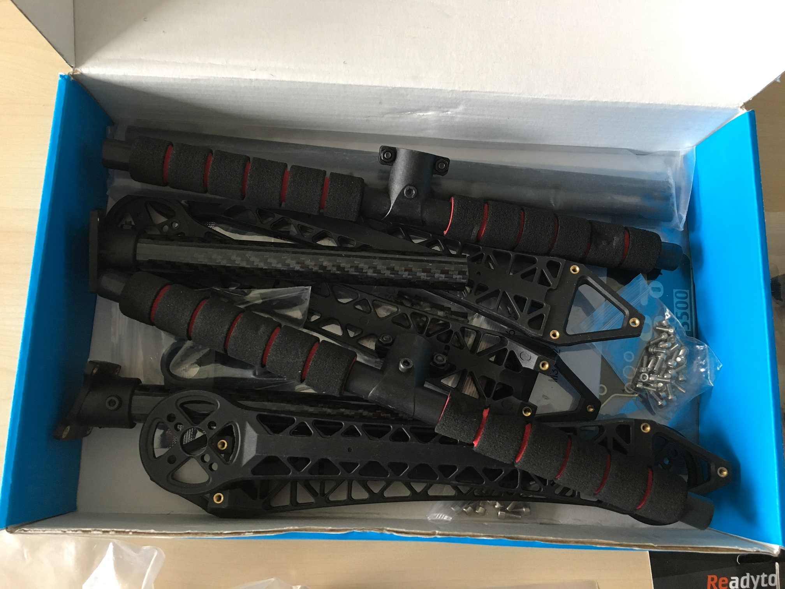

# S500 drone frame assembly


This page is **archived**. You are probably looking for the up-to-date [assembly guide](../../userguide/assembly/).


This section is a guide on how to build the HoverGames drone with the S500 drone frame. It works best when the pages are read in the order in which they appear in the menu. You should start with mounting the motors, and finish with mounting the FMU and GPS.


The S500 drone frame was included in early drone kits in 2018. All new kits send out to HoverGames participants should include the new LJI X4 500 drone frame, which [has its own section](../../userguide/assembly/) with assembly instructions.

Also, this section is still based on the RDDRONE-FMUK66 Rev. B (also known as NXPhlite). When RDDRONE-FMUK66 Rev. C is released, this section will not be updated anymore and will become outdated.


