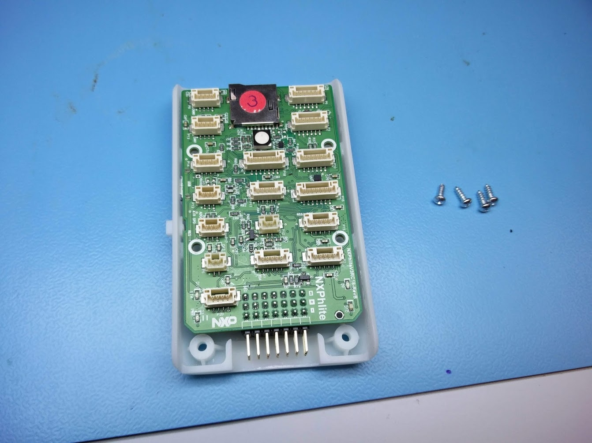
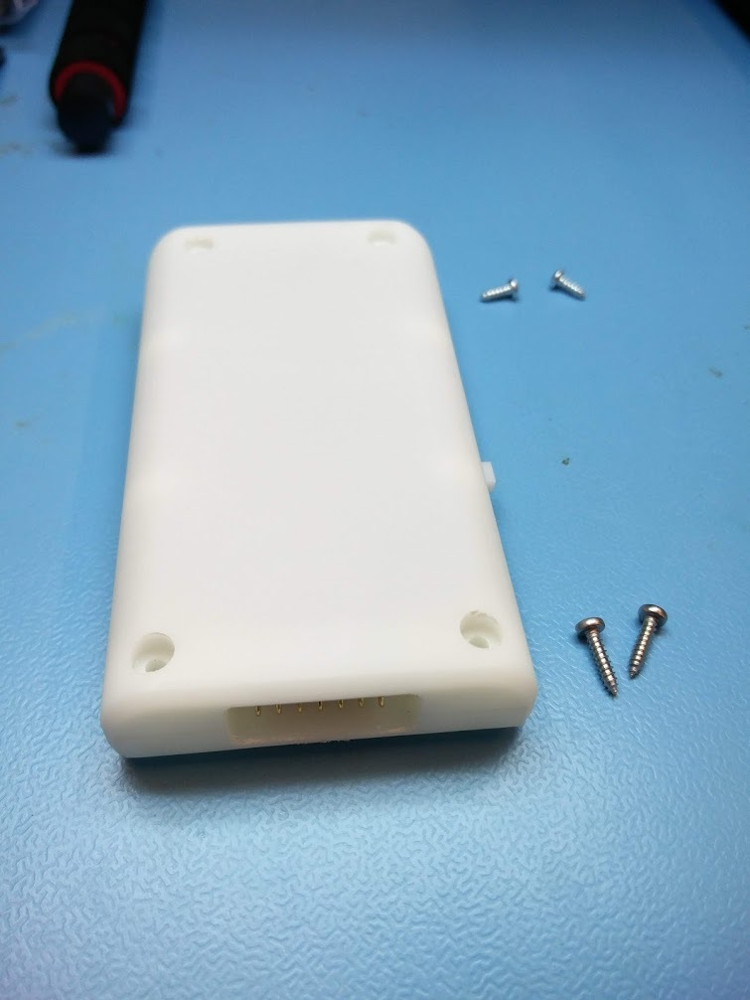
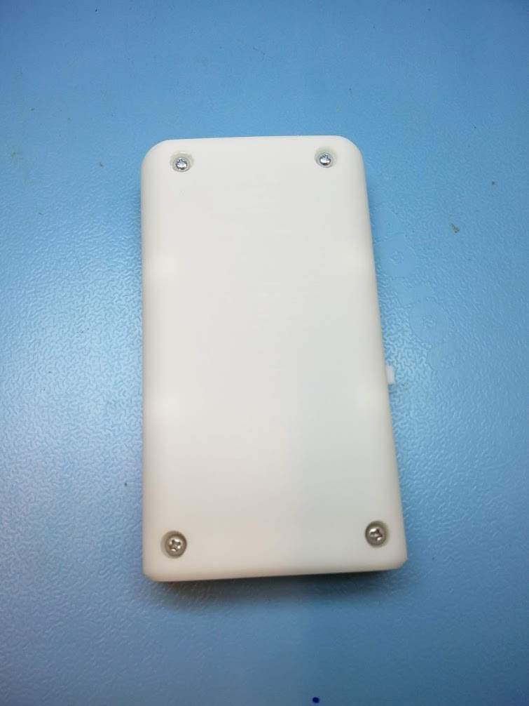

# Installing the FMU in its case


This page is **archived**. You are probably looking for the up-to-date [assembly guide](../../userguide/assembly/).


The FMU comes with a 3D printed casing, which still has to be assembled. It consists of a top and bottom part and a tiny piece which presses against the reset button. The FMU should first be screwed down to the bottom part of the casing with four short screws of about 7 mm long.


It could be that the FMU board still has stickers on top of its connectors. You should take them off before you put the FMU inside its casing.


After the FMU is screwed down to the bottom part of the casing, you can put the top part on and turn the whole case upside down. You need to short screws (7 mm) and two longer screws (about 10 mm) to keep the two halfs of the case together. The longer screws should go in the holes on the side of the servorail of the FMU. The short ones go on the side of the SD card slot.

