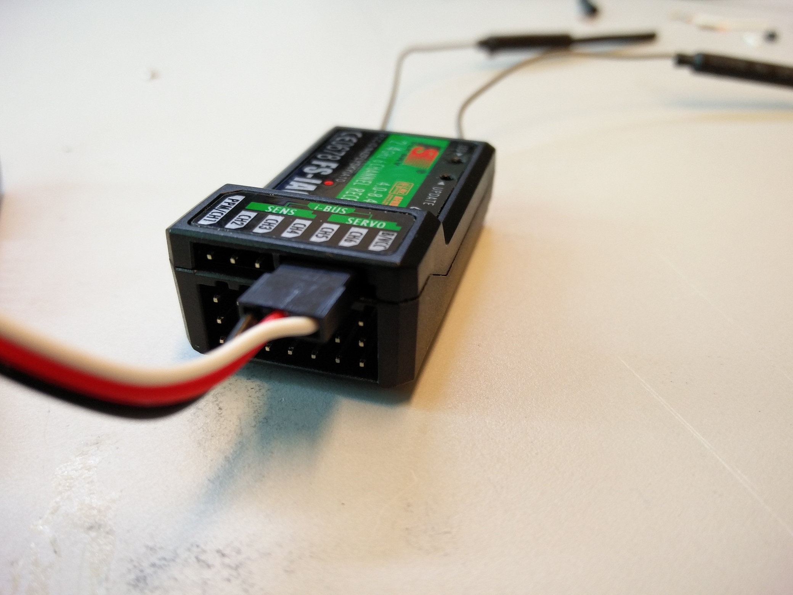
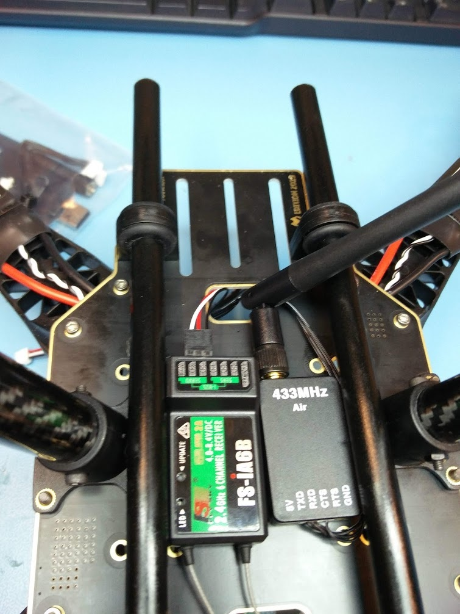
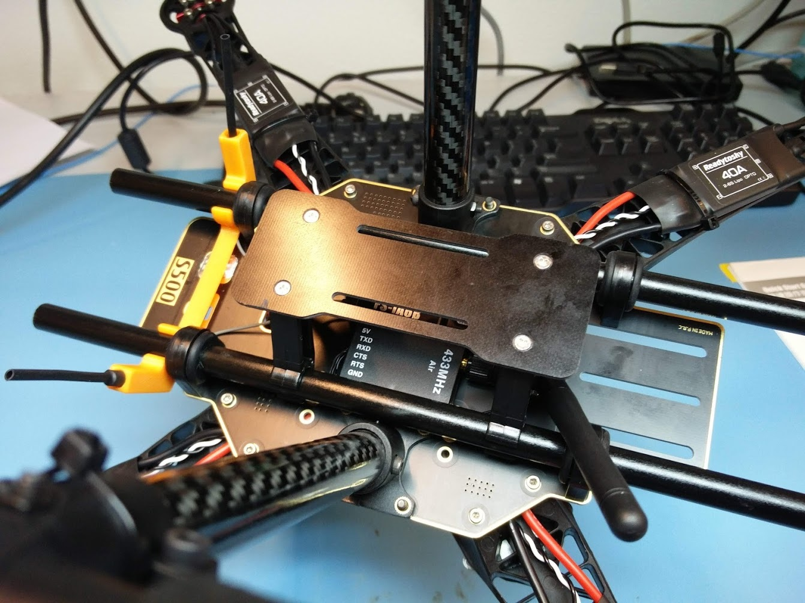

# Installing the radios


This page is **archived**. You are probably looking for the up-to-date [assembly guide](../../userguide/assembly/).


## RC receiver

The receiver for the radio controller has two antennas that work best when under an angle. A 3D printed part is included in the kit which can hold the antennas and fits onto the rails. The antennas should fit right into it, as can be seen below.

The cable that will later go to the FMU should be plugged into the pins labeled `i-BUS SERVO`. The signal wire (white) should be on the outside. Also see the picture below.


NOTE that the RC transmitter also  needs to be set for S-BUS output. Follow the instructions at link below:



[radio-controller-setup](../../userguide/radio-controller-setup/)


## Installing the RC receiver and telemetry radio

The radio receiver itself and the telemetry radio transceiver can be mounted with some double sided tape. They should fit between the rails, as can be seen below. The 3D printed antenna mount can be put onto the rails near the back of the drone.

The cables coming from the radios should go through the hole near the front of the drone. We will later connect them to the FMU when we install it on top of the drone.

## Battery plate

We can now also install the battery plate. It consists of a carbon plate with two clamps that are put together with four small screws. It is easiest to put the clamps onto the rails first, on then screw the carbon plate to them. When the drone is finished, you can strap the battery to this plate using the velcro strip included in the kit.

