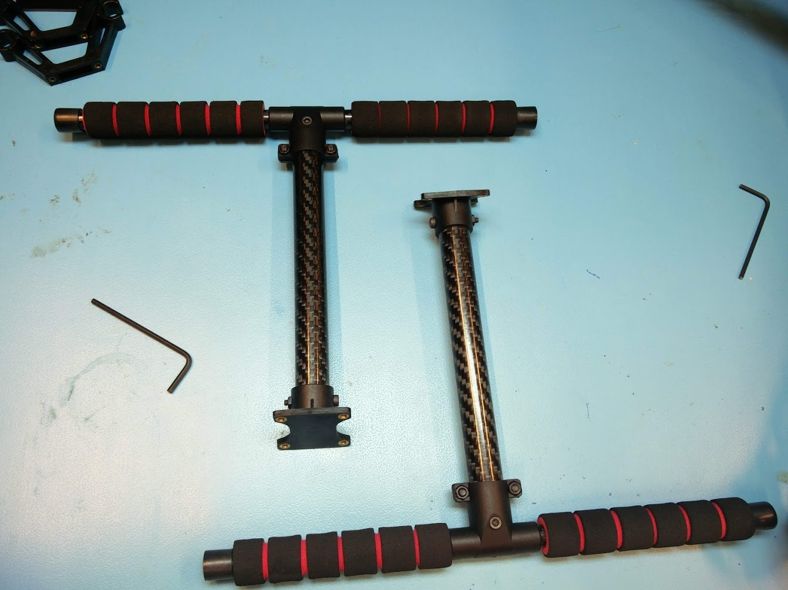
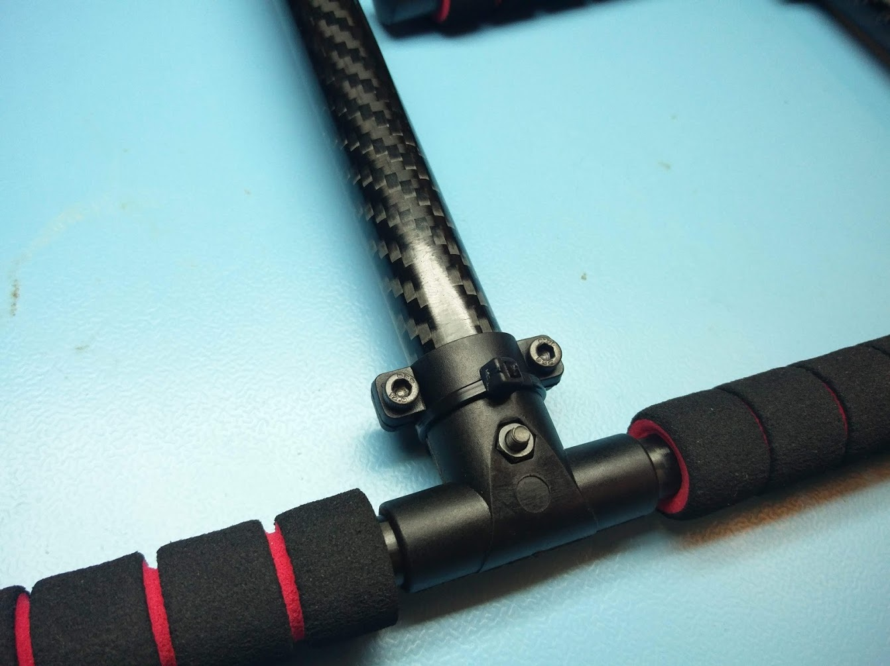
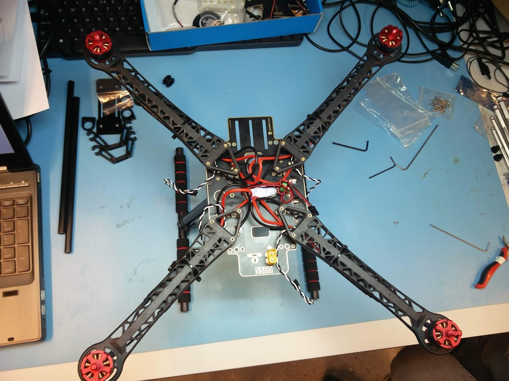
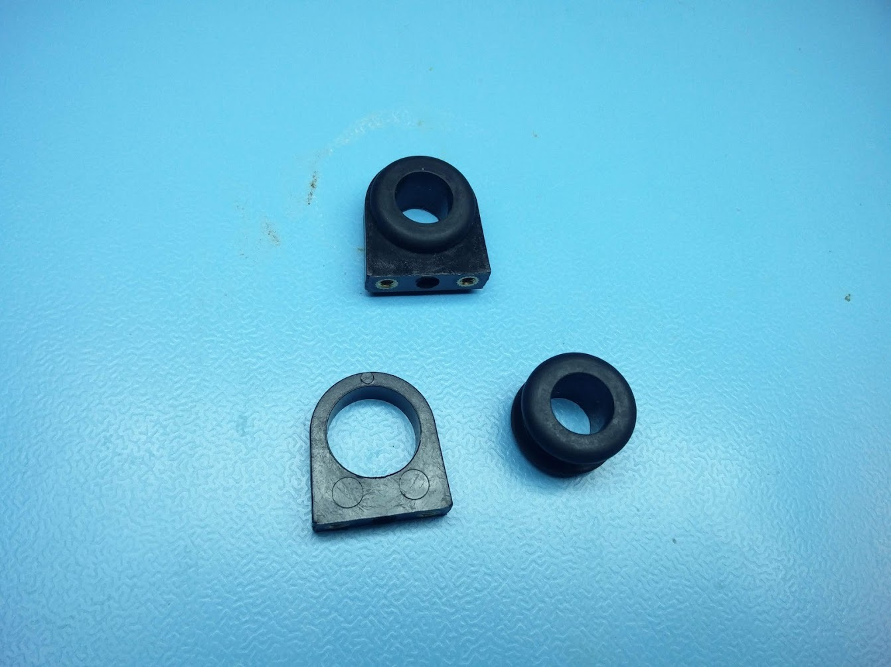
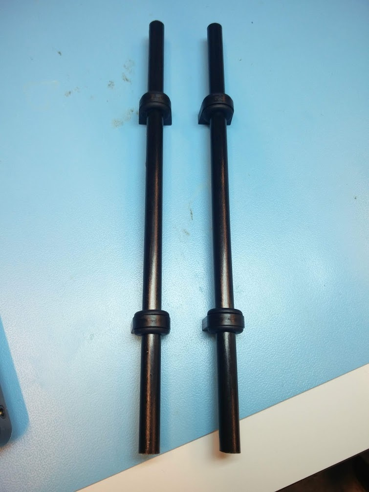
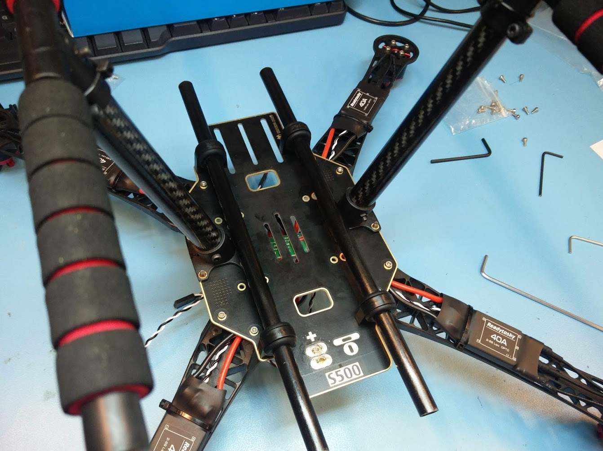

# Landing gear and rails

## Mounting the landing gear

The first step is to put together the landing gear and mount it to the bottom frame. Each leg consists of a bottom part with foam and a T-shaped junction, and a carbon rod with a part that can be mounted to the bottom plate with four black M3 screws.

It might be a good idea to reinforce the landing gear with some zip ties. Cracks might occur in the plastic T-shape junction when you have a hard landing. A zip tie is a quick fix and could help prevent this from happening.

Each leg is mounted to the bottom plate with four black M3 screws from the top.

## Mounting the rails

The next step is to mount the rails on the bottom of the frame. These rails are an easy way to mount new components on bottom of the drone.

The first step is to put the rubber rings into the plastic parts. There are two for each side, so four in total. The purpose of the rubber rings is to keep the carbon rods from moving around. Don't mount them to the bottom plate yet, it is easier to first put carbon rods through them before we install it to the rest of the frame.

It requires quite some force to put the carbon rods through the rubber rings. Therefore, it is easier to do this before you mount it to the bottom plate. Try to position them as close as possible to where they should be when we mount it to the frame. We will use the outermost holes to mount the rails, not the ones close to the legs.

The rails are mounted with two M2.5 screws per plastic part, so four per side and eight in total. The rails go on bottom, on the screws come in from the top.

