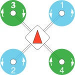
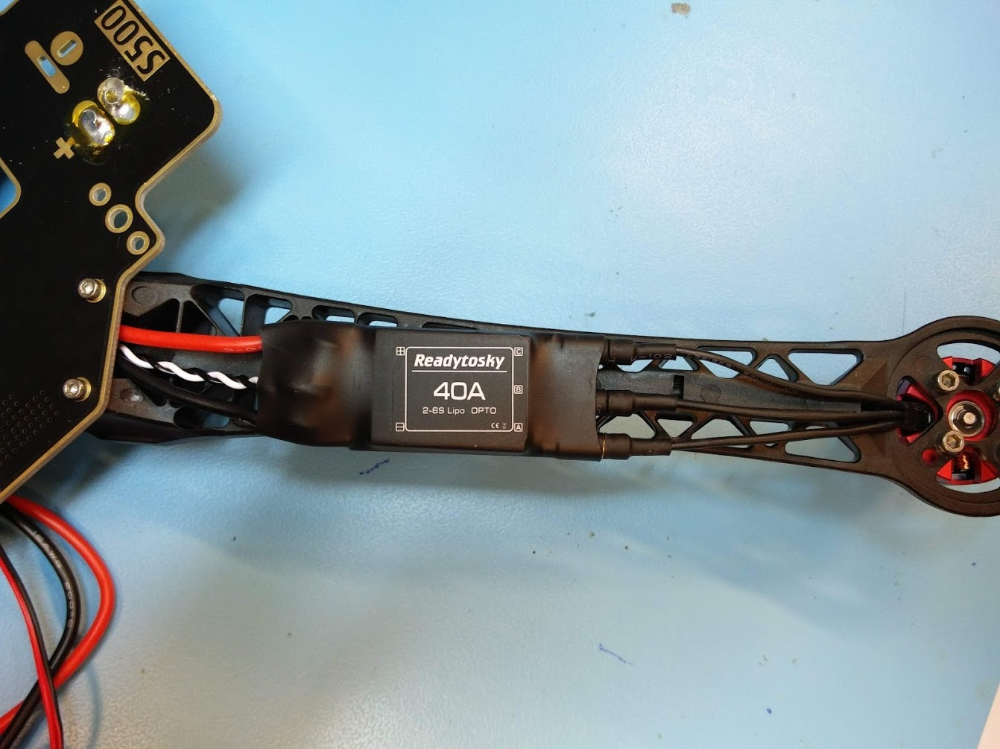
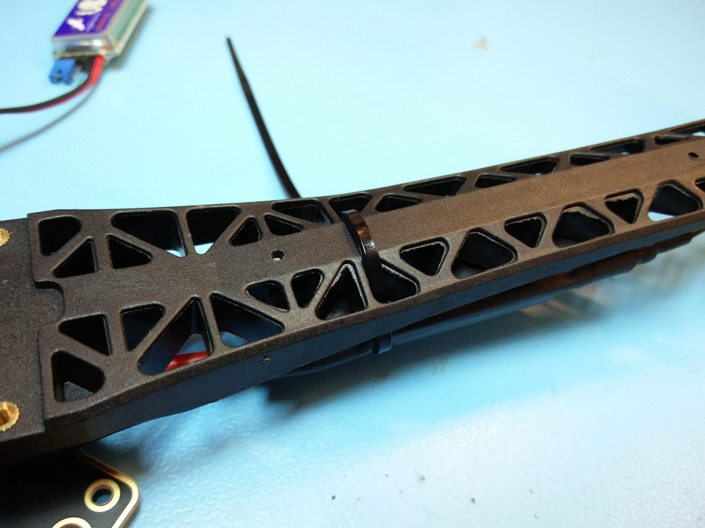
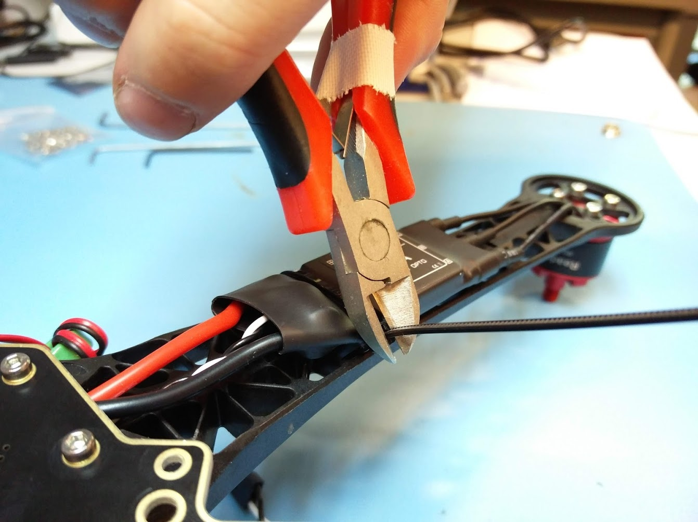
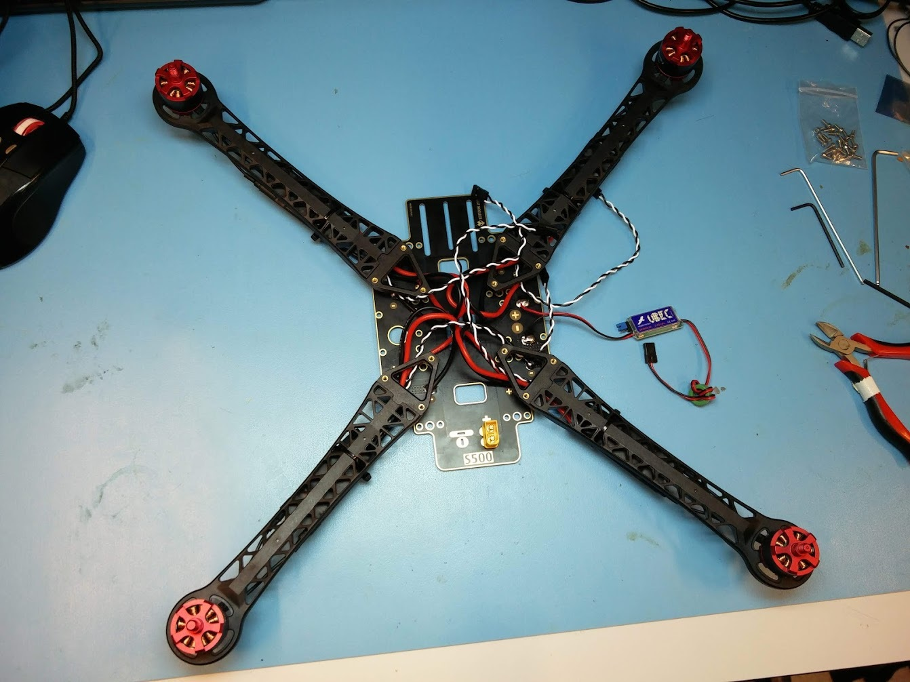

# Mounting ESCs and arms


This page is **archived**. You are probably looking for the up-to-date [assembly guide](../../userguide/assembly/).


## Clockwise and counter clockwise rotating motors

As mentioned on the previous page, we have two kinds of motors. Clockwise rotating motors have a little mark on top of their shaft, and counter clockwise rotating motors have a smooth top.

The motors should be mounted according to the following diagram. The motors on the front left (#3) and back right (#4) should turn clockwise (motor with mark), and the front right (#1) and back left (#2) should turn counter clockwise (motor without mark).\

\
The top side of the bottom plate is the side with the soldering pads. The S500 text should be at the back of the drone, the part with the slits should be at the front. The front left and back right should have an arm with a clockwise rotating motor (which have a mark on top of the motor shaft). The front right and back left should have arms with motors rotating in the counter clockwise direction (which have a smooth top of the motor shaft).

## Mounting the arms

Turn the whole board upside down and "fold back" the ESCs so the wires make a nice loop in the middle of the board. This is similar to what is shown in the picture above with all four ESCs soldered. Take one of the previously assembled arms with the correct motor, and position it so all the wires coming out of the ESC fit in the small area as shown below. Make sure you are using an arm with the correct motor, especially now that you have turned the board upside down.

You can now use two M2.5 screws to mount the arm to the board. Make sure all wires are still where they should be.

Repeat this for all four arms, and double check that you have installed the right motors at the right position. The overview as seen below should match with the schematic provided above.

## Mounting the ESCs

The next step is to connect the motors to the ESCs and make sure the ESCs are properly attached to the frame. We will use zip ties for this.


The three bullet connectors coming from the motor have a piece of heat shrink tubing over them. Sometimes, the glue from this heat shrink tubing is also on the part of the connector that goes into the ESC. It should be visible, but it will also be clear when you need a lot of force to get the connector into the ESC. If this is the case, make sure to wipe of the glue. You might need to use some alcohol. If you don't do this, it might cause connection issues.



The order in which the three wires from the motors are connected to the ESCs does not really matter. For now, just connect them in what order is easiest. You will only have to touch them later if the motors rotate in the wrong direction. When that happens, you can simply swap two of the cables to have the motor rotate in the other direction.


The ESCs can be strapped underneath the arms with zip ties. The zip ties go through the holes in the arm and fit nicely around the part of the ESC where the power input and signal wires come out. One zip tie per ESC should be enough, but you can add a second one if you want.

## The results so far

At this point, we should have the bottom plate ready with the XT60 connector, ESCs and possibly the UBEC soldered to it. The motors and ESCs should be mounted to the arms, and the arms should be screwed down to the bottom plate.

Now make absolutely sure the motors are in the right positions. The motors with a mark on top of their shaft should be at the front left and back right. The motors without a mark should be on the front right and back left. The front of the drone is the part with the slits on the bottom plate. The back is the part with the XT60 connector.

If you find you have made a mistake with the motors, you can just unplug the ESC wires, unscrew the M3 screws that keep the motor in place and change two motors. You don't have to change the whole arm. The ESCs are the same for clockwise and counter clockwise rotating motors, so they can stay in the same place.
