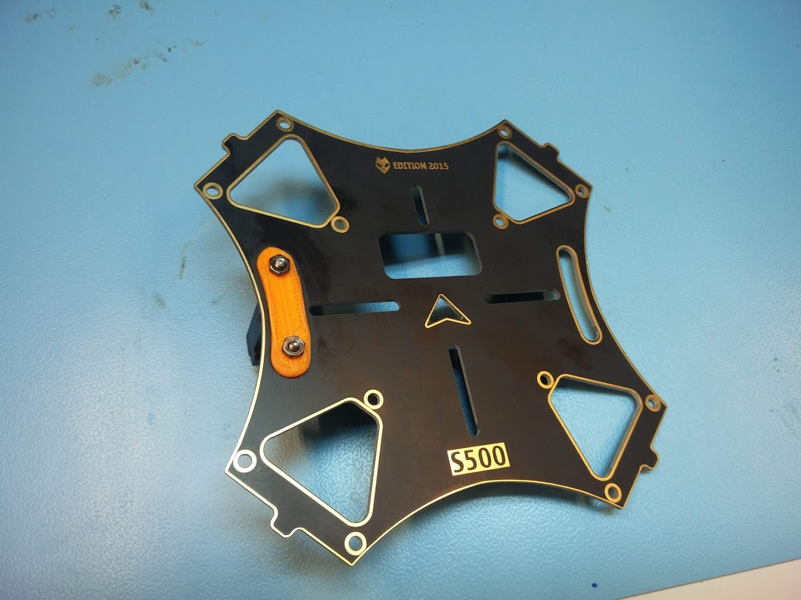
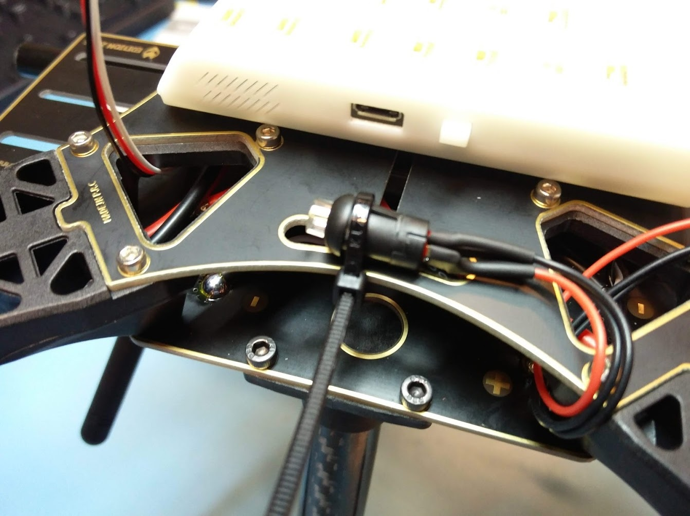
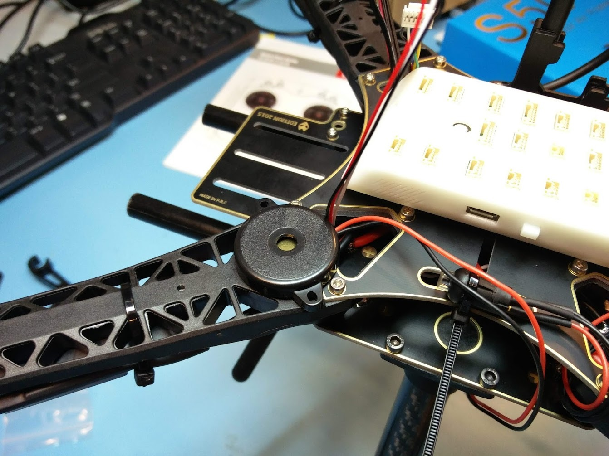

# Mounting the GPS and FMU


This page is **archived**. You are probably looking for the up-to-date [assembly guide](../../userguide/assembly/).


## Mounting the top plate and GPS

Before we install the FMU onto the drone, we should first install the GPS when we still have the space to do so. A small 3D printed part is included in the kit which allows us to mount the GPS mast to the top plate. The 3D printed part goes underneath, the base of the GPS mast goes on top and we use the included screws and nuts to keep it in place. It should be mounted on the right side of the top plate.

You can now mount the top plate onto the rest of the frame. You need 12 M2.5 screws. The "arrow" should point towards the front of the frame, which should be the part with the slits in the bottom plate.

Next, you can put the GPS mast together. You might need to use some super glue if the rod can turn around too easily inside the plastic parts. The plastic part on the bottom of the rod can be mounted to the base part that is already mounted to the top plate.

Finally, you can use the double sided foam tape to put the GPS on top of the GPS mast. The arrow on the GPS should be aligned to point forward.

## Mounting the FMU, arming switch and buzzer

The FMU can also be mounted on the top plate with a few pieces of double sided foam tape. It should be as close to the center of the drone as possible.

The safety switch can be mounted with a simple zip tie, as can be seen below.

Finally, the buzzer can be installed on the front left arm with a small piece of double sided foam tape.

