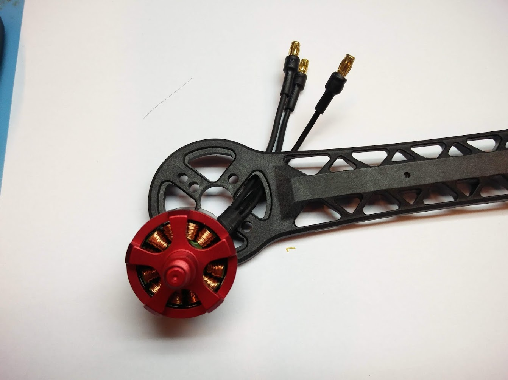
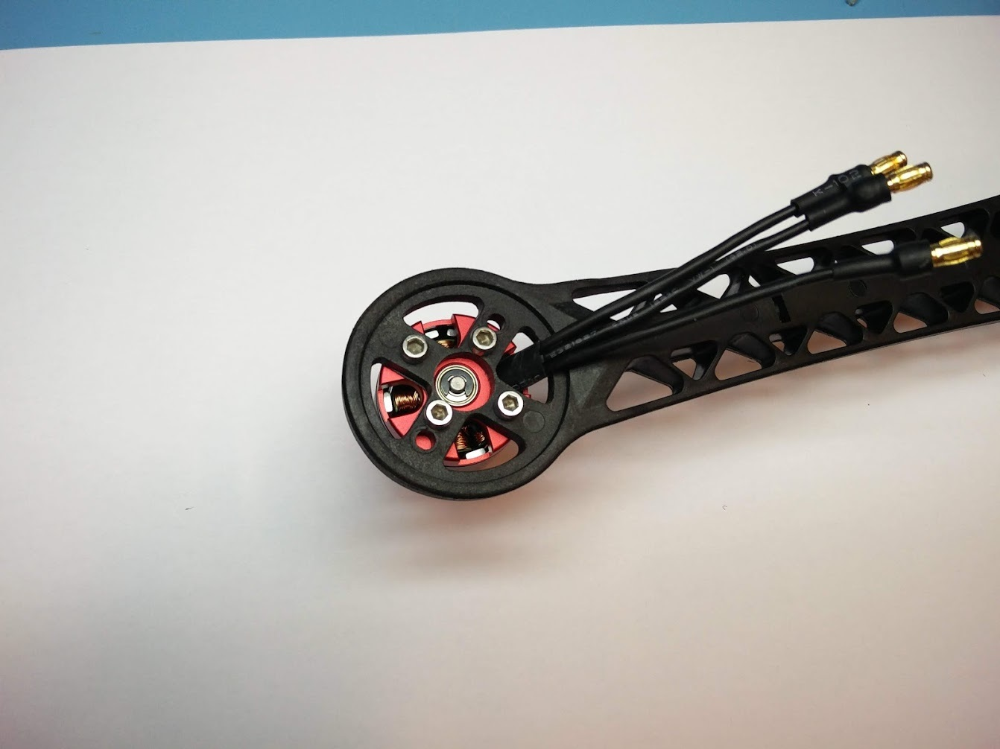
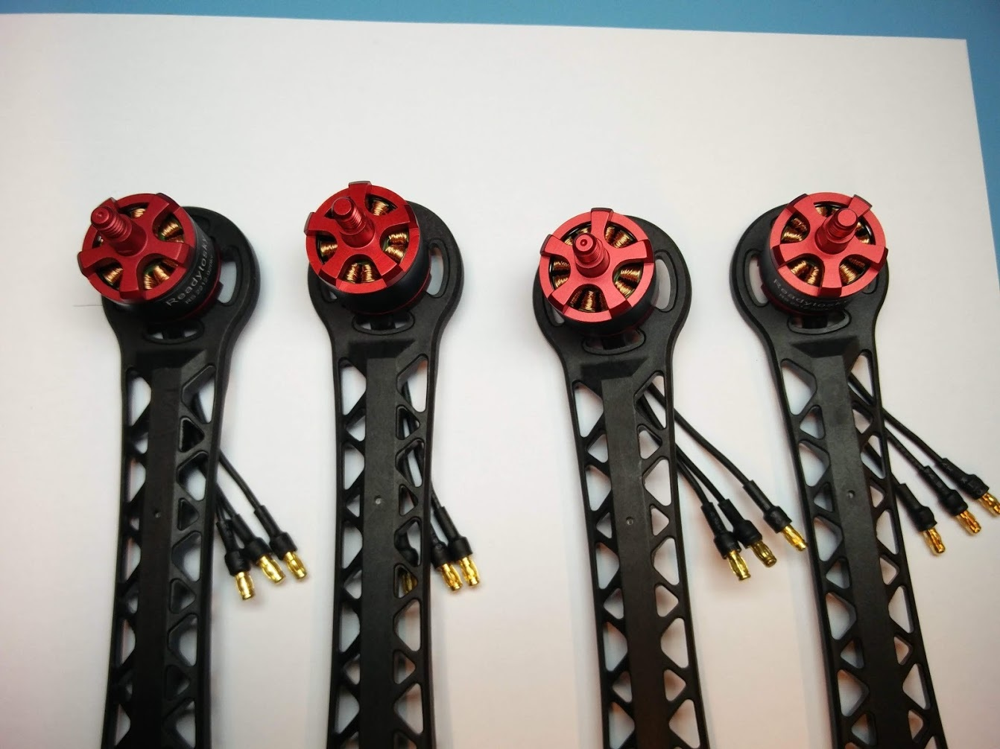

# Mounting the motors


This page is **archived**. You are probably looking for the up-to-date [assembly guide](../../userguide/assembly/).


We will start by mounting the motors to the arms of the frame. Put the three wires coming out of the motor through the hole as shown in the picture below.&#x20;

Each motor is mounted by four M3 screws. Make sure to use all four of them and tighten them firmly. You can use washers (metal rings) in between if they are available, but it is not required.

You should now have the motor mounted to the arm like in the picture below. Make sure the motor is on top of the arm and not on the bottom!

Repeat the process three more times, until you have mounted all four motors onto the arms. You will see that there are two motors with a mark on top of the shaft. We will come back to this later. It indicates the direction of the threading and in which direction the motor should rotate.

