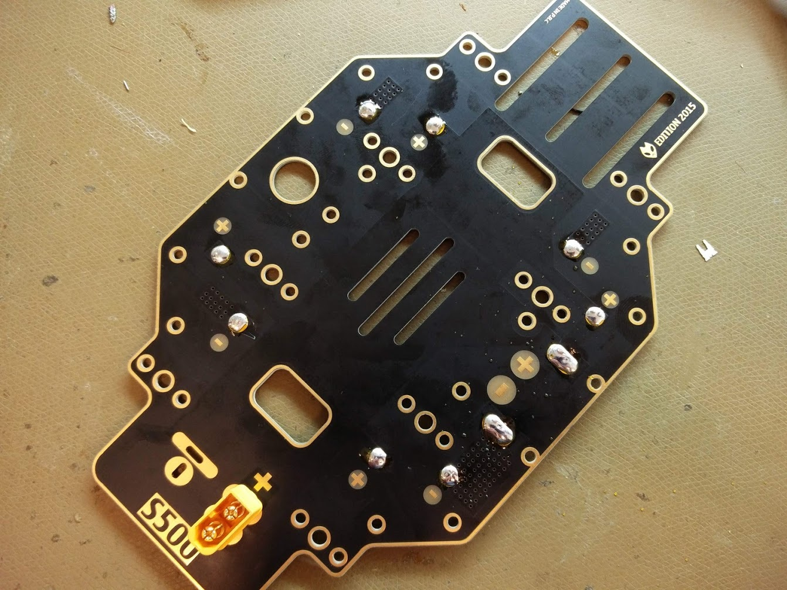
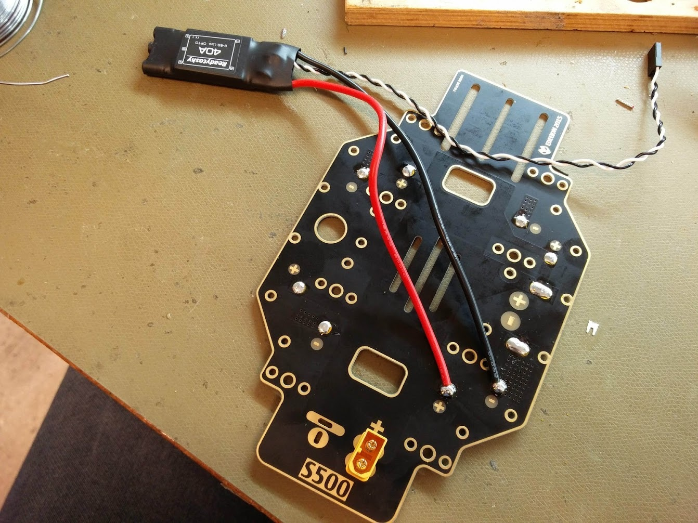
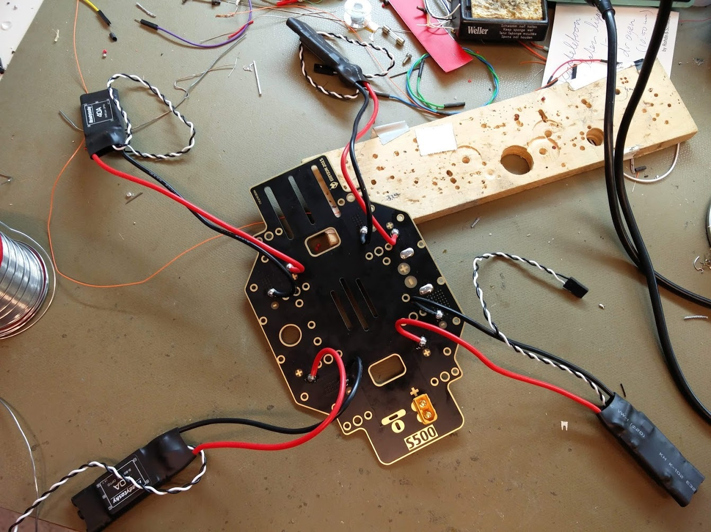
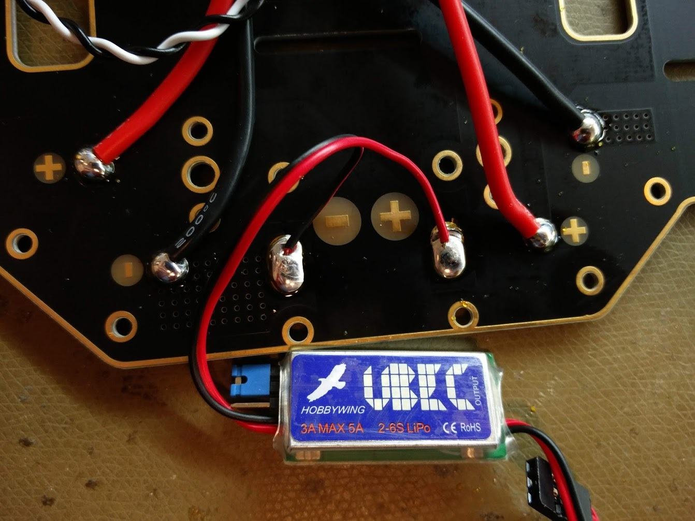

# Soldering to the PDB


This page is **archived**. You are probably looking for the up-to-date [assembly guide](../../userguide/assembly/).


Next, we will start soldering all components onto the power distribution board (bottom plate of the frame). The top side has solder pads for ESCs, as can be seen in the picture below.

## Soldering the XT60 connector

We will start with soldering the male XT60 connector for the battery power input, because it is a bit harder to solder than the ESCs. The male XT60 connector is the one with the two metal pins on the inside, and it should have the letter "M" on its side. On the other side it should also indicate the polarity, or which side is positive (+) and which side is negative (-). This should match up with the symbols on the board.

The XT60 connector goes on top of the board and is soldered from the bottom. All other components are soldered on top. Make sure to use enough solder to make a good connection to the board.

## Soldering the ESCs

After you have soldered the XT60 connector, you can add some solder to all ten soldering pads on top of the board. There are four pairs for the ESCs, and one pair on the side meant for a UBEC.&#x20;

Note that a UBEC [might not be included](../../userguide/getting-started/not-included-items.md) in your HoverGames drone kit and is not required for most setups. Instructions for installing a UBEC are provided for the sake of completeness.

You can now easily solder the ESCs onto the board. We chose to solder the ESCs in such a way that the long wires coming from the ESCs go to the middle of the board. Make sure that the red wire is soldered to the positive pad (+) and the black wire to the negative pad (-).

## Soldering the UBEC

If you have a UBEC available, you can solder it in similar way to the pair of pads on the side of the board. Again, solder the wires in such a way that they point towards the middle of the board, and make sure you get the polarity right (red is positive, black is negative).

