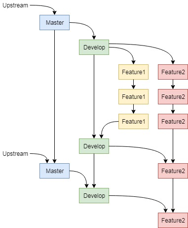

# Git source code management

## Git basics

Git is one of the most popular tools to manage source code and keep track of changes. It is also a great tool to prevent conflicts when working together in a team. If you are not yet familiar with Git, we strongly advice you to learn the basics. Git is used for managing many open source software projects, but it is also used extensively in corporate environments. It is an invaluable tool for anybody working with source code.

There are already plenty of resources available on the internet to learn Git, therefore we will not repeat the basics here. The [official Git website](https://git-scm.com/) provides a [complete e-book for free](https://git-scm.com/book/en/v2), as well as [some introductory videos](https://git-scm.com/videos). You can also use the (interactive) tutorials by [GitHub](https://try.github.io/) and [Atlassian Bitbucket](https://www.atlassian.com/git/tutorials). Last but not least, [this blogpost by Nico Riedmann](https://dev.to/unseenwizzard/learn-git-concepts-not-commands-4gjc) also provides an excellent overview of the most important Git concepts.

The sections below will try to address some practical issues and more advanced concepts that you might run into when developing software for HoverGames. Keep in mind that you can always have a look at the [Git reference](https://git-scm.com/docs) in case you "feel lost".

## Command line or graphical interfaces

Git is a command line tool, however there are [graphical interfaces available](https://www.git-scm.com/downloads/guis). If you have worked with graphical user interfaces for years, it might be attractive to install a graphical interface for Git as well. However, a graphical interface will just be a layer on top of the Git commandline and you will probably not understand what is really going on behind the scenes. Also, once you learn to use the command line properly you will see that it can be much quicker to use and it has some very powerful tools that are often not available in any GUI.&#x20;

The commands can be hard to memorize at first, but remember that you can always look at the [Git reference](https://git-scm.com/docs). At the top of the reference page there are also links to cheat sheets that list the most important commands. A web search will also quickly provide you with the right commands and hopefully also some explanation as to why you need to use that specific command.

## Initial configuration

After [installing Git](https://git-scm.com/book/en/v2/Getting-Started-Installing-Git) there is some additional configuration needed. If you are using a GUI tool this configuration might be taken care of automatically or you will get a popup. However, most people will be using the command line and need to do this configuration by themselves.

The first and most important thing you need to do is set your name and e-mail. All your commits will be linked to this name and e-mail. Initially your commits will only be local (on your own computer), but if you start pushing commits to remote repositories, your name and e-mail will also be published with these commits.

You can configure your name and e-mail with the following two commands (replace with your own name/e-mail):

```
git config --global user.name "John Smith"
git config --global user.email "johnsmith@example.com"
```

It is possible to avoid "leaking" your e-mail address if you want to keep it private. [GitHub](https://github.com/) is one of the largest Git-based code sharing platforms and many of the remote repositories that you will work with are hosted on GitHub. GitHub offers the option to [use a special "noreply" e-mail](https://docs.github.com/en/github/setting-up-and-managing-your-github-user-account/setting-your-commit-email-address#setting-your-commit-email-address-in-git) if you create a free account.

It is also convenient to tell Git what "core" editor you want to use. This can be a very simple text editor like Gedit or Nano on Ubuntu, or Notepad on Windows. A full IDE is usually not needed, as Git will only use this editor for simple tasks like entering commit messages. You can still use any other editor (with more features) to write and debug your code.

You can configure Gedit as your core editor with the following command:

```
git config --global core.editor "gedit --wait --new-window"
```

On Linux you can just provide the command that would start the editor. On Windows you usually need to provide the full path to the executable. There is [a list available with commands for different editors](https://git-scm.com/book/en/v2/Appendix-C%3A-Git-Commands-Setup-and-Config#\_core\_editor).

More information is available on the "[first time Git-setup](https://git-scm.com/book/en/v2/Getting-Started-First-Time-Git-Setup)" page in the Git documentation.

## Different Git workflows

Git can be used in different ways and many teams have their own workflow. [Atlassian Bitbucket offers a great overview of some different Git workflows](https://www.atlassian.com/git/tutorials/comparing-workflows). It will give you some insight in how Git can be used to work together on a larger software project.

The PX4 Developer Guide explains the most used workflow for contributing to PX4 Autopilot. It is based on the [GitHub flow](https://guides.github.com/introduction/flow/). The PX4 documentation explains their basic [branching model and code formatting](https://dev.px4.io/master/en/contribute/code.html), as well as [Git examples](https://dev.px4.io/master/en/contribute/git\_examples.html) that show you how to clone a forked PX4 repository, how to pull newest commits from the upstream master and more. This is a great starting point for most people.

## Sharing is caring - but what to share with the community?

PX4 and Dronecode are very important for the HoverGames. Most participants will work extensively with the PX4 Autopilot software and extend it with their own software. It would be great if changes and additions that could be useful to other people are shared with the PX4 community. Think about:

* Bug fixes!
* Drivers for new components!
* New features
* Exciting ideas

Even if you think that your work is not ready to be merged into the main PX4 repository, consider creating a [(draft) pull request](https://docs.github.com/en/github/collaborating-with-issues-and-pull-requests/about-pull-requests) or issue on the [PX4 GitHub](https://github.com/PX4/Firmware) to at least make the developers aware of it. You can also ask the core development team on [Slack](../contact.md#px4-slack-and-forum) what they think about your fix/addition/idea and what would be the next steps to get it merged.

Most teams will probably also create some software that is very specific to their use case. It might not really be possible or useful to share all these software additions, but you can always start the discussion on [PX4 GitHub](https://github.com/PX4/Firmware), [Slack or Discuss](../contact.md#px4-slack-and-forum) to learn what would be good additions to the main PX4 project.


If you are participating in the HoverGames as employee of a company, you have to make sure that you are compliant with the policies of your company. You probably do not want to share any intellectual property without approval of your employer.

This is especially the case for NXP employees, who have their own internal HoverGames competition. Any software developed by NXP employees as part of the internal competition has to be reviewed before it can be published, unless it is just a small bugfix.


## Working with multiple Git repositories


The next sections discuss more **advanced concepts** and might not be easy to grasp if you are just getting started with Git. Take your time to learn about the basics of Git, look on the internet for additional information and ask questions if you have any issues.&#x20;

Also remember that Git is just a tool. You do not have to use all of its features right from the start! It's fine if you **start with the basics now** and **implement a more advanced workflow later**.


The PX4 Autopilot source code is hosted on GitHub, and it is recommend that you make your own PX4 fork on GitHub as well. You can do this under your own GitHub account, or you can fork the repository under an organization. You can [create an organization on GitHub](https://help.github.com/en/articles/about-organizations) for free as long as your repositories remain open source. Using a repository under an organization allows multiple people to manage the same repository, but you can also [work together on a personal repository](https://docs.github.com/en/github/setting-up-and-managing-your-github-user-account/inviting-collaborators-to-a-personal-repository).

However, there might be cases where you want to keep (some of) your code private. It is recommended to still have a public fork which you can use to publish bugfixes and changes that you want to merge back into the main PX4 repository. You can setup a second, private, online repository on websites like GitHub or Bitbucket to hold the code that you want to keep hidden from the general view.


Using **different repositories** is just one part of the workflow when working together. You should also think about using **different branches** to keep different fixes and features separated. More about this will be explained below in its own section.


The graph below shows an example of the different repositories and the flow of data once everything is set up. In general, the local repositories of the individual team members (users) are the starting point of all changes. They add their own code, but also pull in changes from the shared repository (a private Bitbucket repository in this case) or from the upstream PX4 Firmware repository. They publish changes (new code, or pulled changes from the upstream repository) to a private Bitbucket repository.

When something is ready to be made publicly available, it can be pushed to the public GitHub repository as well. From this public GitHub repository you can then create a pull request to the main PX4 repository to ask them to merge your changes.

.jpg>)

For a team that is not using a private repository, their public GitHub repository will be the place to share code within the team. This simplifies the graph (and the workflow) significantly. You only have to keep track of the code changes in one place, and you can directly create pull requests from your main repository to the "upstream" PX4 repository.

Note that if you are working alone, you will still have your local repository, your online repository on GitHub and the upstream PX4 repository. That also means that you can easily start working together at any time. The whole setup with different repositories does not really change, except that each user has their own local repository.



This example uses Bitbucket for the private repository, but you could also use a second GitHub repository, or other platforms such as GitLab. Keep in mind that this is merely a very general example. You are free to put together your own workflow and select your own tools.&#x20;


## Setting up your repositories

### Forking the PX4 Firmware repository on GitHub

The first step is to [create a fork](https://docs.github.com/en/github/getting-started-with-github/fork-a-repo) of the PX4 Firmware repository on GitHub. [Create a GitHub account](https://github.com/join) if you do not have one, and go to the [official PX4 Firmware repository](https://github.com/PX4/Firmware). Press the "Fork" button on top of the page and fork the repository under your own account or under an organization. You can click your profile picture and go to settings and then create a new organization if you want.


### Cloning the repository on your computer

You now have a your own public fork of the PX4 Firmware, but to actually make changes you want a local clone of the repository. To clone your own repository from GitHub, enter the command below in the command line. The URL specifies the location to the online repository that you want to clone. Usually it is of the form shown below, but with your own username.

```bash
git clone --recursive git@github.com:johnsmith/Firmware.git
```

You can also get the right URL for your repository by pressing the green "Code" button on the main page of your forked repository (NOT the original PX4 repository). Make sure to press the small "Use SSH" link in the corner, because it will probably default to "Clone with HTTPS".&#x20;


After you enter the command it will take a while to download all files and setup the local repository.

### Generating an SSH key

When you want to push changes to a GitHub repository, you will be asked for a password and it will be checked if you have permission to make changes to the online repository. If you have a private repository, authentication is also required when you clone the repository or pull changes.

An SSH will make authentication very easy (and secure)! We strongly recommend you to generate an SSH key and add it to your GitHub account. It requires a few extra steps but will make your life much easier. [GitHub has an excellent step-by-step guide](https://docs.github.com/en/github/authenticating-to-github/generating-a-new-ssh-key-and-adding-it-to-the-ssh-agent) on how to generate and add an SSH key. Make sure that you select "Linux" at the top of the page if you are using Git within the Ubuntu virtual machine.

### Setup an extra private repository

It is not required, but some people might want to use a private repository to create an online backup of their code or share it between different team members without giving the whole world access. For example, you could setup a private repository on Bitbucket.

It might be possible to "import" an online repository directly. You can use this option to make a direct copy of your public GitHub repository. You can also create an empty repository and push the code into it from your local repository, which we will do here, because this option is always available.

When the local repository was created ("cloned"), the original GitHub repository was automatically set as the standard remote repository named "origin". We will change this now to your private repository, because this is usually your default repository that you want to push to. You need to replace the URL with the URL your new (private) repository.

```bash
git remote set-url origin git@bitbucket.org:johnsmith/gestures.git
```

You can now push the code that you downloaded from your public repository into your private repository by using

```bash
git push --all origin
```

You will be asked for authentication. If you have issues with this, please refer to the documentation of the service ([BitBucket](https://confluence.atlassian.com/bitbucket/ssh-keys-935365775.html), [GitHub](https://help.github.com/en/articles/connecting-to-github-with-ssh)) you are using. If you generated an SSH key you can easily add it to your account on the service that you are using.

You should add the public repository again as a remote repository as well. This will allow you to easily push changes to the public repository, for example when you want to open a pull request at the upstream PX4 repository. We'll call it "public". Make sure you use the URL of your own repository:

```bash
git remote add public git@github.com:johnsmith/Firmware.git
```

### Add upstream remote repository

For convenience, we will also add the upstream PX4 repository. This will allow you to easily pull in changes from the upstream repository, which you can push to the repositories of your team (public and/or private) if required.

```bash
git remote add upstream https://github.com/PX4/Firmware.git
```

## Branches

In a Git repository, usually different branches are used to develop different features in parallel or to separate stable versions of the code from code that is still being developed. PX4 uses the "master" branch as their main version of the code. Features are developed in different branches and merged into master when they are ready. (Approximately) every 6 months a new major stable release will be created from the code in the master branch.

When you forked the official PX4 repository, you made a copy of all code revisions and branches up to that point in time. It is recommended that you make new branches (branching off from your copy of master) for your own features. You can keep pulling in commits from the official PX4 repository to keep your own repositories up-to-date with the upstream master branch. Note that you first have to apply changes to your local repository and then push these changes to your shared repositories.

What we recommend is to set up at least two branches. Master should correspond to the upstream master branch, you can pull changes from the official PX4 repository into this branch. Your own work should be kept in a development branch, consider this your own main branch. From this development branch, you can branch off again to develop different features, and merge them back into the development branch when they are finished. At the same time, you can also pull in changes from master if desired. This is summarized in the graph below.



The following command will create a new branch "hovergames\_feature" and checks it out as your current working branch.

```bash
git checkout -b hovergames_feature
```

Prepare a commit

```
git add file
git commit -m "Commit message"
```

Setup default remote branch and push

```
git push --set-upstream origin hovergames_feature
```

From now on, for this branch, you can directly push to your main remote repository (origin) with the command:

```
git push
```

If you have both a public and a private repository, you can also push to the public repository by specifying its remote name and branch name. The following commands pushes the changes to the remote that we defined as "public".

```
git push public hovergames_feature
```

## Pull requests

A pull request is a request to merge the changes made in a certain branch into another repository or branch. This is not a Git feature, so it is not available in your local repository, but it is a tool in online services such as GitHub and BitBucket. It allows discussion and additional explanation of the changes before they are actually merged. More information is available in the [GitHub documentation](https://help.github.com/en/articles/about-pull-requests) and the [Bitbucket documentation](https://www.atlassian.com/git/tutorials/making-a-pull-request).

The [official PX4 Firmware repository](https://github.com/PX4/Firmware) uses pull requests to manage all contributions to their source code. Anybody that wants to make any changes to PX4 has to create a pull request so the core development team can review and discuss the changes. If you ever have any changes or additions that you want to contribute to the main PX4 project, you should put them on separate branches (split different features and bugfixes to make it easier to review) on your own public fork of PX4. Then you can directly create a pull request from this branch on your own repository to the PX4 master branch.

## Resources

* [Git Documentation](https://git-scm.com/doc)
* [GitHub.com Help Documentation](https://docs.github.com/en/github)
* [GitHub - Resources to learn Git](https://try.github.io/)
* [Atlassian Bitbucket Documentation](https://support.atlassian.com/bitbucket-cloud/resources/)
* [Atlassian Bitbucket - Getting Git Right](https://www.atlassian.com/git)
