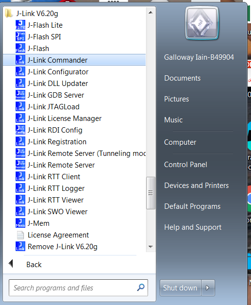
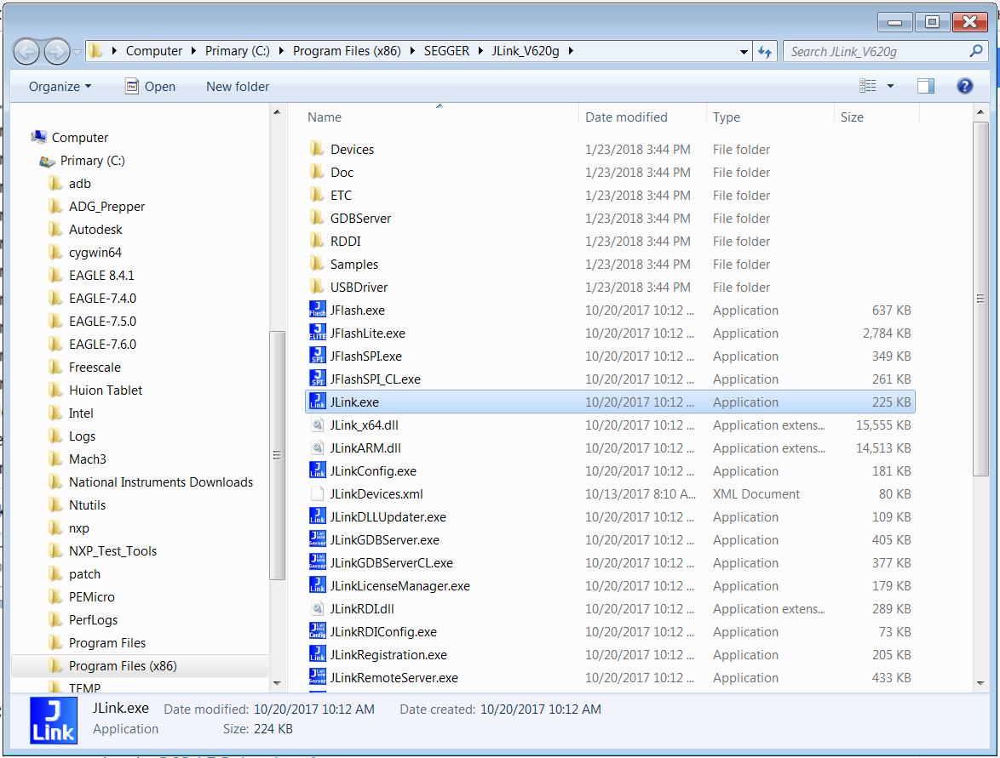
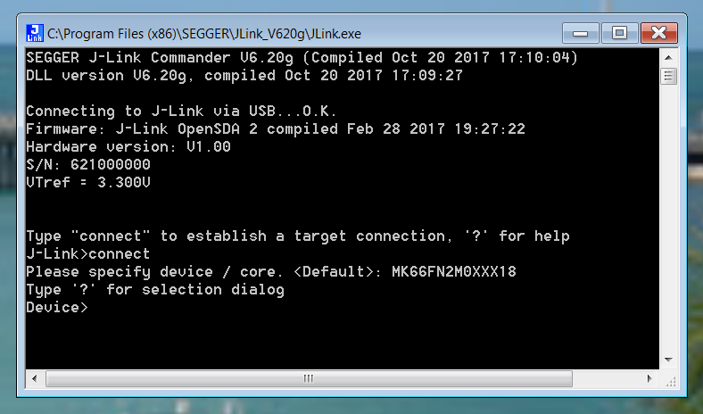
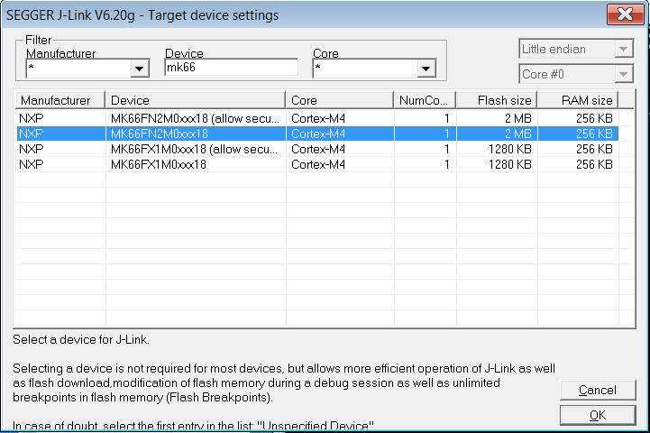
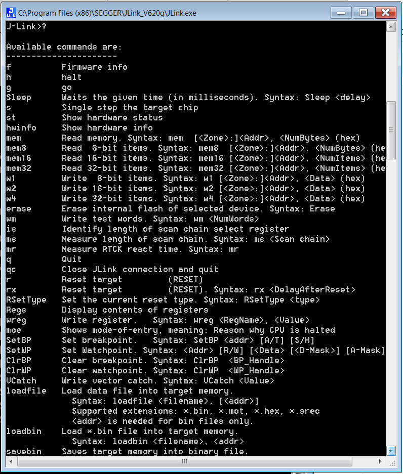
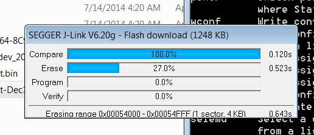

# Program software using debugger

To program a blank board, or recover a board that has been "bricked", or simply to have low level access to the MCU, you will want to use a **J-Link** or other SWD (Serial Wire Debug) capable programmer. Normally there is a standardized 10 pin header that is used for ARM debuggers. On the RDDRONE-FMUK66 the DCD-LZ interface is used to carry these signals, plus a primary serial console. To connect the J-Link debugger to the FMU you will use the DCD-LZ adapter as mentioned below.

This section will show the basics of how to install the software for using the J-Link programmer, and which commands to use to program a binary (\*.bin) file.

## Connecting the debugger to the FMU

The HoverGames drone kit includes an adapter board for the RDDRONE-FMUK66 DCD-LZ interface which allows a standard J-Link debugger and a USB to 3.3V TTL serial interface to connect using the 7 pin JST-GH connector on the RDDRONE-FMUK66 board.

This picture below shows the J-Link EDU Mini and an FTDI-USB-UART-3V3 plugged into the DCD-LZ-ADAPT board and then connecting to the DCD-LZ port an RDDRONE-FMUK66. This is the setup as included in the HoverGames drone kits. Note that the FMU has to be powered using a micro USB cable.

.jpg>)

The 7-pin JST GH cable connects the debug adapter board to the FMU. The USB-TTL-3V3 cable plugs in as shown below. The **black (GND) wire should be on the same side as the small notch/mark** on the orange case! The SWD cable goes between the adapter board and the J-Link EDU Mini debugger.&#x20;

### Alternative debugger configurations

Shown below is the Landzo OpenSDA Debugger with an adapter board connected to the 7-pin JST-GH RDDRONE-FMUK66 DCD-LZ interface.

.png>)

## J-Link Software setup

You will need the J-Link Commander program, which is part of the J-Link Software pack. Installers for different operating systems are available at Segger's website. Links are available on our [download page](../downloads.md#j-link-software-and-documentation-pack).

On Windows, you will find J-Link Commander under the program menu after installation. It can be found in a directory similar to this:

You can also browse to the installation folder and run the program from there. Usually, the J-Link Software pack is installed to a location similar to `C:\Program Files (x86)\SEGGER\JLink_Vxxxx`. Note that the name of the J-Link Commander executable is actually JLink.exe.

On a **Linux OS**, you can only run the executable through a commandline. You can directly run J-Link Commander from its installation directory by entering `/opt/SEGGER/JLink/JLinkExe` in the commandline.

## Establishing a connection with J-Link Commander

When prompted, type `connect` to establish a connection with the debugger.

### Set the target device

The next step is to specify the target device, which is referring to the microcontroller that is on the RDDRONE-FMUK66. For the RDDRONE-FMUK66, the correct selection is `MK66FN2M0XXX18`. You can enter this by hand, or enter `?` to bring up a selection dialog in which you can select the right device. The selected device will be remembered in next sessions, meaning you can just press enter to select the saved default.


MK66FN2M0XXX18 is the target device for RDDRONE-FMUK66 (NXPhlite).



This selection dialog might not work on operating systems other than Windows. If it does not work, restart the program and enter the right device manually, by typing the full device name (MK66FN2M0XXX18) instead of the question mark (?).


### Select the target interface and speed

&#x20;Enter `s` to select SWD as the target interface.&#x20;

You can accept the default target speed of 4000 kHz by just pressing `enter`.

The JLink will then connect to the target. You should see something similar to this:

### J-Link help

At this point you can type `?` to get help and a list of commands that JLink accepts. Note the command `loadbin`, we will use it later.

## Flash binary files to the FMU board

When a connection is established, you can flash binary files to the FMU board using the same commandline as we used before. We will use the `loadbin` command to write binary files to the FMU.

The general format of the command is as follows: `loadbin <path to binary file> <target memory address>`

The path to the binary file is an absolute path, and the target memory address is a hexadecimal address. The default address is 0x0, when no address is given. The PX4-compatible bootloader should be written to memory address 0x0, while the firmware should be at memory address 0x6000. The bootloader is then automatically started when the board receives power, and the bootloader then loads the firmware located at memory address 0x6000.

Depending on whether you are flashing the bootloader or firmware, you will have to enter a command similar to this:

* Bootloader: `loadbin /complete/path/to/bootloader.bin 0x0`
* Firmware: `loadbin /complete/path/to/firmware.bin 0x6000`


When your path includes a whitespace, you will need quotation marks around you path, like so:

`loadbin "/another path/to/bootloader.bin" 0x0`


Depending on the size of the binary, it might take a while to flash. A pop-up will appear which shows the different steps. It will first check the contents of the binary and match it against the contents of the memory on the board. If they are equal, the binary doesn't have to be flashed. Otherwise, the old contents of the memory are first erased. Then the contents of the binary are programmed into the memory, and finally it is verified that it was done correctly.

.png>)

That is everything. You may need to press reset on the board, or power cycle for the new code to start running on the RDDRONE-FMUK66. Note that with just a bootloader, the board will not do much. You will need both a bootloader and PX4 firmware for the board to function as intended.

## Convert from .elf to .bin

Previously, no .bin files were available. To upload the software to the board with the J-Link debugger, you had to convert the .elf to .bin manually. On Linux, this can easily be done using the following command:

`arm-none-eabi-objcopy -O binary nuttx_nxphlite-v3_default.elf nuttx_nxphlite-v3_default.bin`
