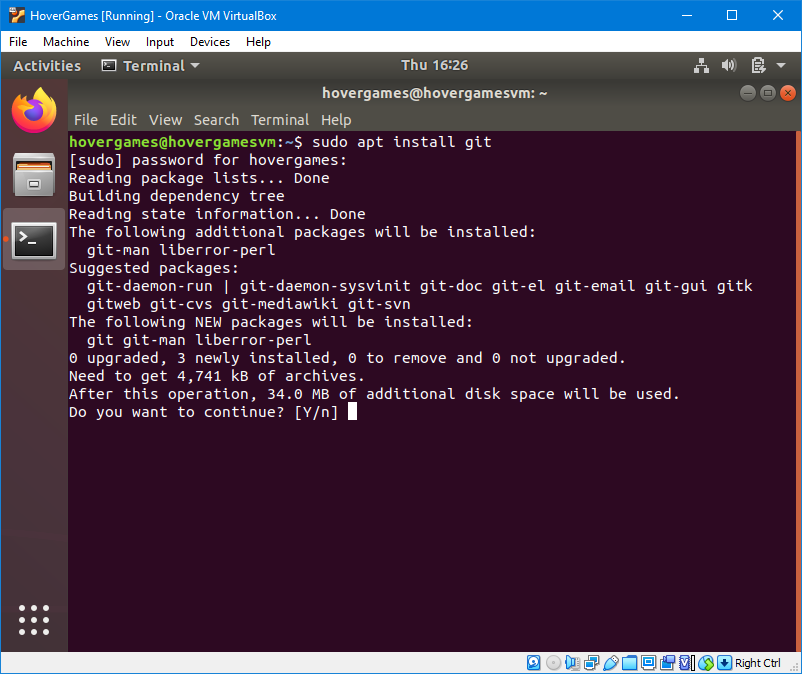
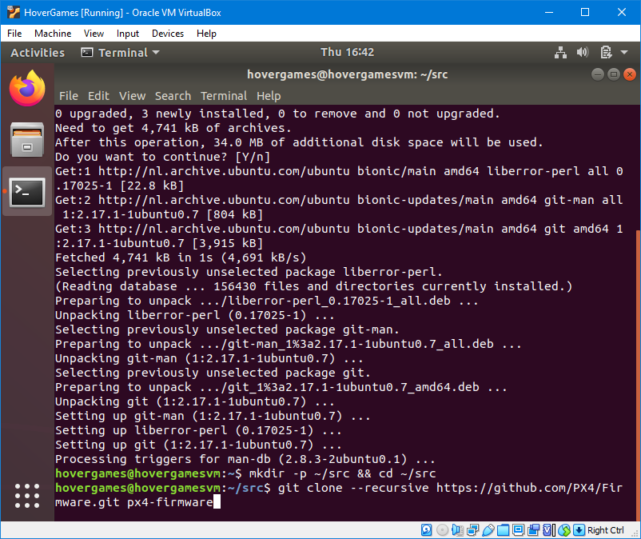
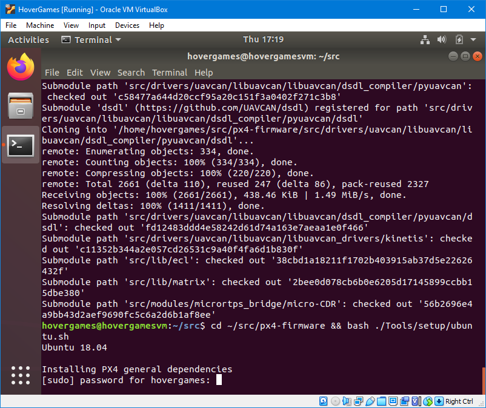
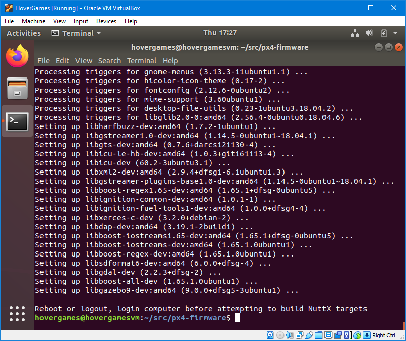
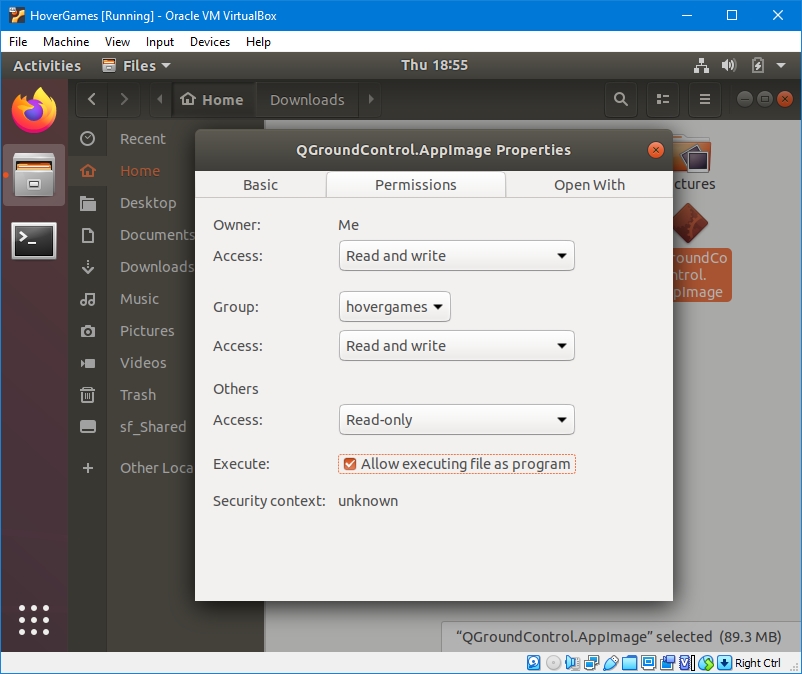

# PX4 toolchain

To start building PX4 firmware from source, you should first install the PX4 toolchain. This provides you with all the tools required to develop, build and debug PX4 Autopilot, but the same tools are also often used for other software projects. You could directly install the toolchain on your main operating system, but we recommend to install it inside the virtual machine we created as described on the previous pages.

## Install Git

The minimal installation that we selected does not include Git by default. Git is a very popular distributed version-control system and you will probably use it a lot when developing software for the HoverGames.  It will also allow us to easily download \("clone"\) the PX4 code because it is available on GitHub, which is a Git-based source code hosting platform. 

So let's install Git using the following command:

```bash
sudo apt install git
```



## Download the PX4 source code

Before we install any tools we will download the PX4 source code. The PX4 developers have included a script that makes it much easier to install all required tools. Let's first create a folder to hold all sourcecode that we are going to work with. The following command creates the "src" folder in the user's home folder \(if it doesn't exist already\):

```bash
mkdir -p ~/src
```

The next step is to actually download the source code. We will use Git to create a local copy of the online repository that is hosted on GitHub. The following command first changes the working directory to the "src" folder that we just created, then it will "clone" the whole PX4 firmware repository, including submodules, in a new "px4-firmware" folder.

```bash
cd ~/src && git clone --recursive https://github.com/PX4/Firmware.git px4-firmware
```

Note that it will take a while to clone the whole repository. The PX4 source code should now be available in the `~/src/px4-firmware` folder. The tilde represents the current user's home folder within the file system. You can also browse to this location with the file manager.



## Install the toolchain

As already mentioned, the PX4 developers provide a bash script to easily install all the tools that you need to build the PX4 firmware. We already cloned the PX4 source code, so we can just change our working directory and run the script:

```bash
cd ~/src/px4-firmware && bash ./Tools/setup/ubuntu.sh
```

You should reboot the virtual machine after the installation is done.





## Make your first PX4 build

Make sure to reboot your computer after the toolchain installation is finished. Then change your working directory to the PX4 firmware repository again and start a build for the FMUK66 using the following command:

```bash
cd ~/src/px4-firmware && make nxp_fmuk66-v3_default
```

After the build process has finished, you should be able to find `.bin`, `.px4` and `.elf` files in the `~/src/px4-firmware/build/nxp_fmuk66-v3_default` folder. We will later come back to building your own firmware binaries, when we set up an IDE \(integrated development environment\) to do it for us.

## QGroundControl daily build

You should also install the latest daily build of QGroundControl inside your VM. You probably already have the \(recommended!\) stable version of QGroundControl installed on your host operating system, but you might need the latest development version if you want to play with new \(experimental\) features of PX4.

Luckily, it is much easier and quicker to switch between different AppImages in Linux than it is to reinstall another version of QGroundControl in Windows. You don't have to install an AppImage. You only have to make the file executable and then you can run the program immediately.

Links to the latest daily build are provided in the QGroundControl user guide. You need the Linux version.



Save the QGroundControl.AppImage file to an easily accessible location such as the homefolder or desktop. Then, right click on the file, go to the file properties, and give the file permission to execute as a program.


You don't have to update QGroundControl every day. However, you should download a new AppImage regularly \(once a month\) or whenever you run into some issue with QGroundControl. If the issue still exists in the latest daily build then you can [open an issue on GitHub](https://github.com/mavlink/qgroundcontrol/issues).




Alternatively, you can make the file executable by running the following command, assuming the AppImage file is located in your home folder:

```bash
chmod +x ~/QGroundControl.AppImage
```

More information about using an AppImage is available in the QGroundControl User Guide:



You can now continue to the next page. We will [set up the NXP MCUXpresso](mcuxpresso.md) integrated development environment \(IDE\) to edit, build and debug the PX4 firmware.


