# Virtual machine

Most of the popular tools that you can use to develop software for the HoverGames drone kit are best supported under a Linux operating system. MacOS usually works fine as well. Therefore it is strongly recommended to either use a native Linux \(or Mac\) setup, or a virtual machine \(VM\) running Linux on top of a Windows operating system. Using a VM instead of a native setup comes at the cost of processing power and flexibility, but should not be a big issue if you have a modern computer.


[A preconfigured virtual machine is available on our downloads page](../../downloads.md#preconfigured-virtual-machine-image-with-development-tools). It already includes the development tools with the recommend configuration. You still need to [download ](../../downloads.md#oracle-vm-virtualbox)and install VirtualBox. You can import the VM into VirtualBox by going to File -&gt; Import Appliance...

If you choose to download the preconfigured VM, you could skip most of the instructions in this section. However, it will be still be useful to read these pages, as it will provide insight in how the tools are setup and how you can use them. Also, you might want to [enable some extra resources](virtual-machine.md#virtual-machine-properties) for your virtual machine if your computer is powerful enough.

Note that the default _hovergames_ user account also has _hovergames_ as its password!


## Ubuntu and VirtualBox

It is strongly recommended to use a recent Ubuntu LTS \(long-term support\) version for developing your software. As of June 2020, PX4 supports both Ubuntu 18.04 and Ubuntu 20.04, but we **recommend to use Ubuntu 18.04** because it is also supported by most NXP tools. Use of any other Linux distribution or Ubuntu version may give some unexpected issues. 

You can download an .iso image file for free from the Ubuntu website:



The recommended package for creating and running virtual machines is VirtualBox, because it is also an open source project and available free of charge. As of June 2020, the latest version is VirtualBox 6.1.8. Please install VirtualBox and all of its components on your computer before you continue.  




A VirtualBox Extension Pack is also available, which is also very useful to install because it provides support for USB 2.0 and USB 3.0 devices. It is not strictly required though. Keep in mind that this Extension Pack is [licensed free for personal use only](https://www.virtualbox.org/wiki/Licensing_FAQ), which should be okay for most HoverGames participants, but you have to pay a fee for commercial use.

"The VirtualBox Extension Pack is available under the [VirtualBox Extension Pack Personal Use and Evaluation License](https://www.virtualbox.org/wiki/VirtualBox_PUEL), which is a free license for personal, educational or evaluation use, or an Enterprise License, which is a for-fee license that allows most commercial, non-distribution uses restricted by the PUEL."

Employees of NXP Semiconductors or other organizations should check with their IT departments for licence costs.


## Creating the virtual machine

Open VirtualBox and create a new virtual machine using the **blue "New" button** at the top of the screen, or using the "New..." option under the "Machine" tab. Fill in a **name** for your virtual machine which you can easily recognize, such as "HoverGames". The default machine folder location is usually fine. The type should be changed to **Linux** and the right version is **Ubuntu \(64-bit\)**.


If your computer appears to **not support 64-bit** **guest operating systems**, you may need to enable hardware virtualization in your BIOS/UEFI. Look for settings that are called something like "Enable VT-x" \(for Intel processors\) or "Enable AMD-V" \(for AMD processors\).

* On corporate managed Windows 10 machines it may also be that [credential guard is enabled](https://support.microsoft.com/en-us/help/3204980/virtualization-applications-do-not-work-together-with-hyper-v-device-g). You probably have to contact your IT department about this.

Even if your computer is not able to run 64-bit guest operating systems, you can still use the older Ubuntu 16.04.6 LTS release. It is still available as a 32-bit version on its [release page](https://releases.ubuntu.com/xenial/). Not all steps and settings described here will be exactly the same, but it should be possible to get everything to work on a 32-bit OS.


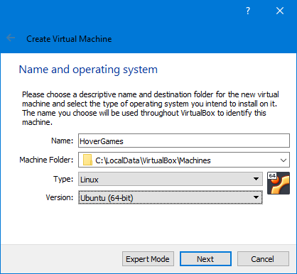

Set the memory size to **at least 4096 MiB**, assuming you have at least 8 GiB of RAM available on your computer. It is recommended to allocate even more memory to your virtual machine if your computer has more RAM installed. For example, if your computer has 16 GiB RAM, you can easily allocate up to 8 GiB \(8192 MiB\) to the VM. More memory generally means a more responsive virtual machine and quicker software builds. Less than 4096 MiB might work, but your VM will probably be very slow.

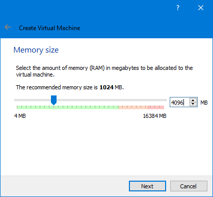

The next window will ask you to add a virtual hard disk. Choose the option to create a new one. The default **VDI file format** is fine, and it is a good idea to make it **dynamically allocated**. You can keep the default name. Please increase the size of the virtual hard disk to **40.00 GB**. This will be the maximum amount of space that the virtual hard disk will use. Under normal circumstances it will most likely stay below 20 GB. If you really want you can add more space, but this should be enough for now.

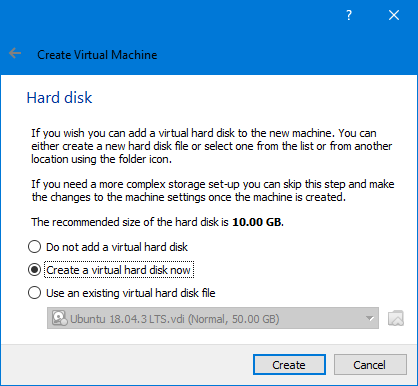

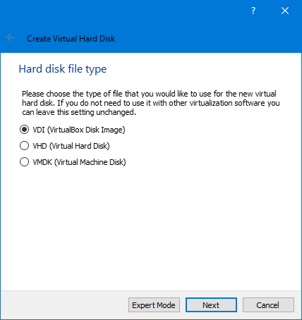

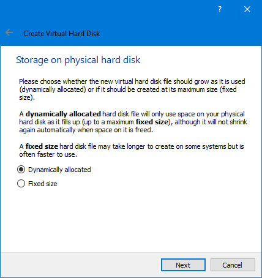

## Virtual machine settings

Select your newly created virtual machine and click the **orange "Settings" button** at the top of the screen, or the "Settings..." option under the "Machine" tab.

Under "General", go to the "Advanced" tab. **Enable the shared clipboard and set it to bidirectional**. It allows you to easily copy and paste text between your host and guest operating systems. You may also enable the drag'n'drop feature, but this has not been the most stable feature of VirtualBox. It is easier to work with a shared folder, which we will create later.

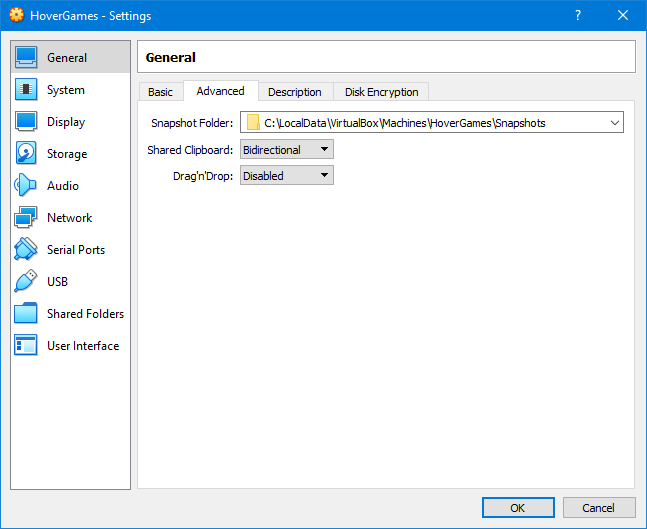

Under "System", you can go to the "Processor" tab. If you CPU has at least 4 cores, you can **add a second core** to your virtual machine. If your CPU has more cores you can even consider to add a third. This will generally make your virtual machine more responsive and speeds up software builds.

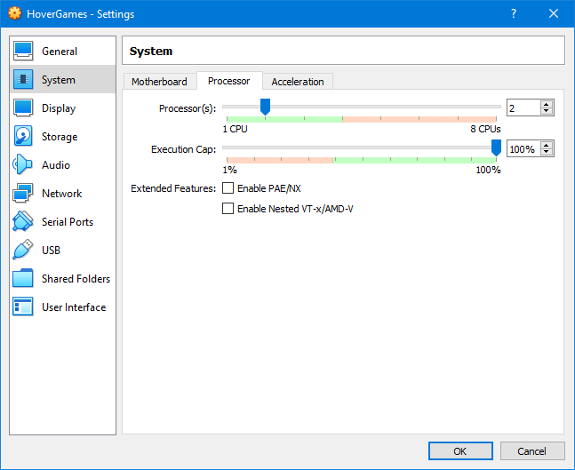

Under "Display", you can **increase the video memory**. You usually want to set this to the maximum value available, but any value within the green range should work well. The green range is the recommended range based on your computer hardware and the selected guest OS.

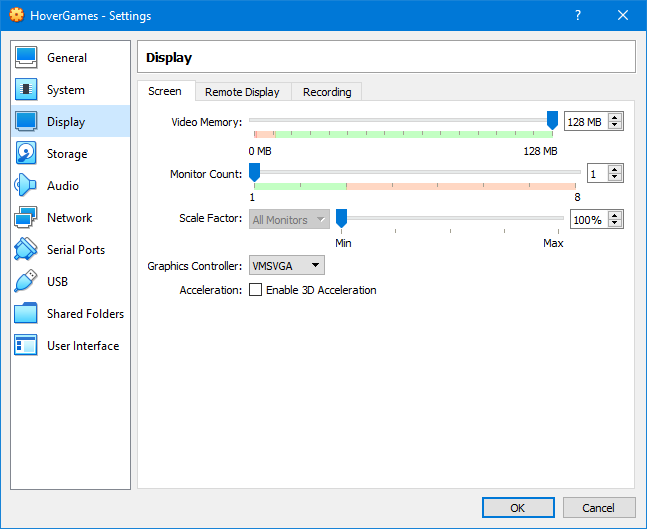

Under "Storage", select the **empty disk drive in the middle of the window**, then click on the small disk icon on the right side of the window and look for the "choose a disk file..." option. Then find the Ubuntu .iso file you downloaded before.

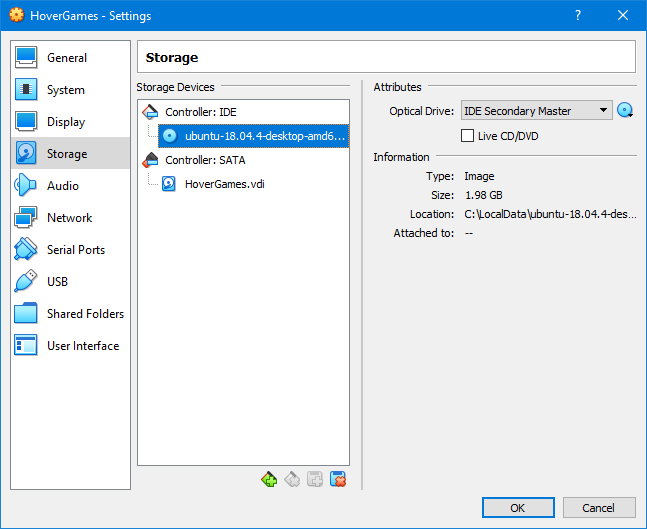

If you have the VirtualBox Extension Pack installed, you can select the USB 2.0 or USB 3.0 controller under "USB". Otherwise you will be stuck with the USB 1.1 controller, which should be fine as well. The USB 2.0 controller is the default option when the extension pack is installed. You can leave it like that for now.

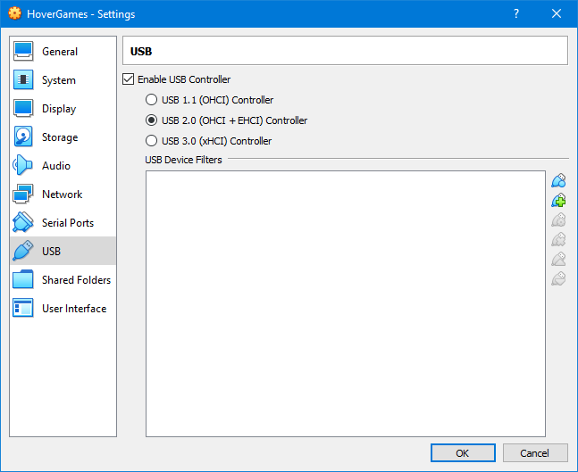

While you're at this screen, also **add some filters for the USB devices** that you will be using. This allows the virtual machine to access these devices whenever they are plugged into your computer while the VM is running. Note that these devices will then not be available on your host operating system.

To easily add a device filter, make sure the device is plugged in and click on the icon with the "+" sign. It is recommended that you add filters for the FMUK66, the J-Link debugger and the USB-UART cable.

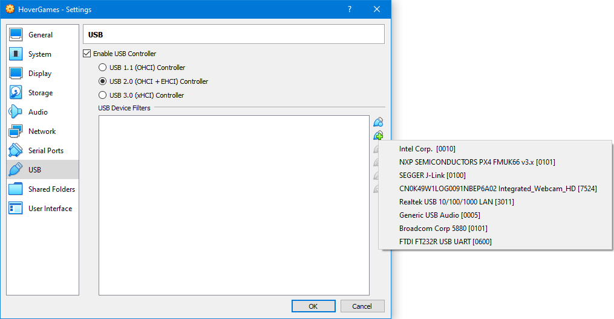

For just a few seconds after you plug in the FMU, the "NXP SEMICONDUCTORS PX4 BL FMUK66 v3.x" device will be available in the list. This is the bootloader. After a few seconds, this device will disappear and "NXP SEMICONDUCTORS PX4 FMUK66 v3.x" will appear. Note that this is only the case if the FMU [already has a bootloader and firmware installed](../../userguide/programming.md)! 

Make sure to add filters for both the FMUK66 bootloader and the "standard" FMUK66 device. If you don't see the bootloader device in the list, make sure the FMU is not powered by anything else than the USB cable. Plug the USB cable in again and quickly click the icon while the bootloader is still active \(orange LED on the FMU will blink\). You have to do this quickly!

Also, make sure to plug in the debugger and USB-TTL-3V3 cable and add filters for "SEGGER J-Link" and "FTDI FT232R USB UART" \(or a name that looks similar\). Be aware that the telemetry radios also present themselves as a FTDI USB UART device if you have one connected to your computer! Their product number should be slightly different, but it's better to disconnect them to avoid confusion.

The list should look similar to this:

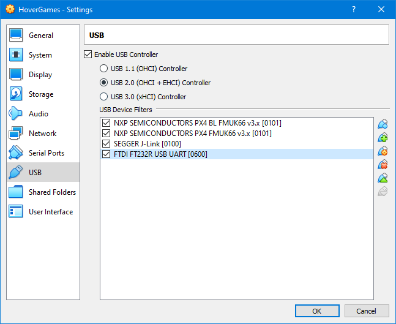

Under "Shared Folders", we can also setup a folder that's accessible on both your host and guest operating systems. Please **create/select an empty folder** on your host operating system, and give it a clear name that will be used by the guest OS. You can enable **auto-mount**, which should work after we have completely installed the operating system \(Ubuntu\) including guest additions. 

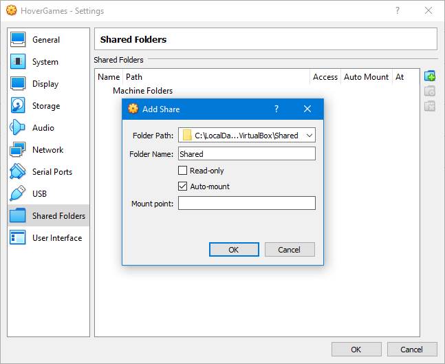

You can now **press the green "Start" button** to run your virtual machine. You may be asked first to select the right boot disk, make sure you select the Ubuntu image. The VM should then start and boot from the provided .iso disk image, starting the installation process for Ubuntu. We will continue on the next page and guide you through this process.

