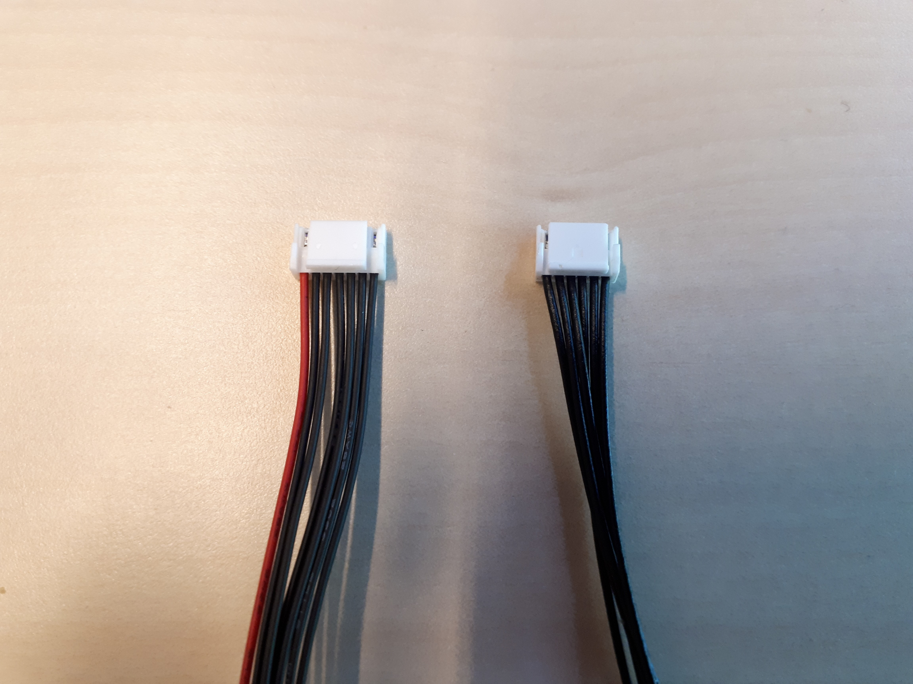
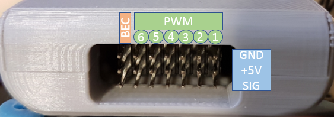
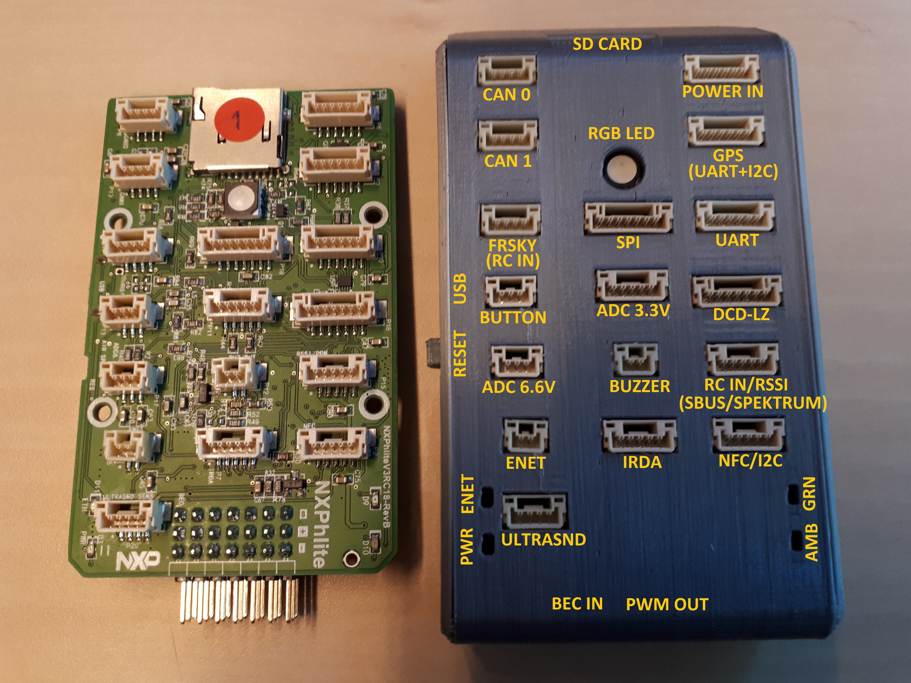

# Connectors and pinout

## Dronecode connectors and cable standard

Most interfaces on the RDDRONE-FMUK66 use the JST-GH connectors as specified in the [Dronecode Autopilot Connector Standard](https://wiki.dronecode.org/workgroup/connectors/start). The [PWM](https://en.wikipedia.org/wiki/Pulse-width_modulation) interface uses "standard" RC hobby servo connections. These PWM connectors are 3 pins spaced 0.100" apart.

The male JST-GH connector has a clip on top. As described in the Dronecode standard, the first \(leftmost\) wire is usually the positive voltage. In some cables this wire is red. The last \(rightmost\) wire is ground. The wires in between carry different kinds of signals, depending on the function.

## RDDRONE-FMUK66 Rev. C connectors

RDDRONE-FMUK66 Rev. C uses the new 10 pin connector for the Holybro GPS module. That GPS module incorporates the arming button and LED, as well as the beeper and an RGB high intensity LED.

## Connector pinout

Each connector has its own page with a pinout table and \(a part of\) the schematic of the connector. Some pages also include additional information relevant to the exposed interfaces. The connector specific pages are listed under this page.

## RDDRONE-FMUK66 Rev. B connectors


Note that Rev. B prototype boards are **deprecated** and **no longer supported**. Information here is for reference only.


The pictures below give an overview of all connectors \(and LEDs\) on the RDDRONE-FMUK66 Rev. B. Most of the labels in the pictures are the same as the labels on the PCB itself.

