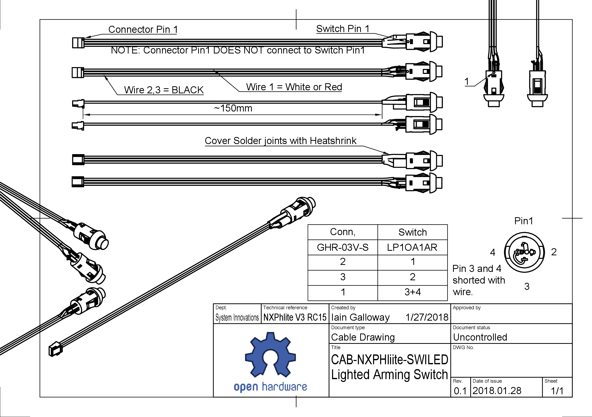
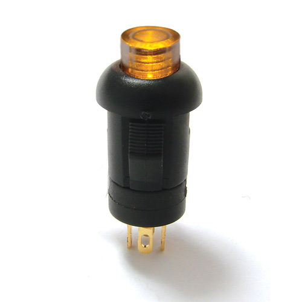

# Arming switch

Previous versions of the RDDRONE-FMUK66 included a separate arming switch connector. The HoverGames drone kit would also include a separate arming switch. However, since the release of RDDRONE-FMUK66 Rev. C a [10 pin connector ](gps.md)is available for the Pixhawk 4 GPS. This GPS module has an arming switch as well.


The 3 pin arming switch connector is **not found on newer versions** of the RDDRONE-FMUK66! The arming switch is included in the GPS module. Please refer to the [GPS connector page](gps.md).


## Connector pinout

| Pin | Signal            | Voltage |
| --- | ----------------- | ------- |
| 1   | VCC               | +3.3V   |
| 2   | SWITCH LED OUTPUT | +3.3V   |
| 3   | SWITCH INPUT      | +3.3V   |

## Schematic

.PNG>)

## Assembly drawing

The HoverGames drone kit will include an pre-built arming switch with the right connector. It should not be necessary to build your own switch. This information is purely for reference purposes.

## Switch specifications and pinout

* [E-Switch LP1 series](https://www.e-switch.com/product-catalog/pushbutton/product-lines/lp1-series-illuminated-round-pushbutton-with-multiple-color-options) switch with integrated LED.
* There are 3 wires on the connector and 4 pins on the switch.
  * Pin 3 and pin 4 on the switch have to be soldered together with a small wire.
  * NOTE: Pin 1 of the connector **does not** go to pin 1 of the switch.
* Polarity of the LED is important!

| JST-GH 3 pin                      | Switch with LED                        |
| --------------------------------- | -------------------------------------- |
| Pin 1 - 3V3                       | Pin 3 - LED (+) (Join pin 3 and pin 4) |
|                                   | Pin 4 - Switch (Join pin 3 and pin 4)  |
| Pin 2 - NSAFETY\_SWITCH\_LED\_OUT | Pin 1 - LED (-)                        |
| Pin 3 - SAFETY\_SWITCH\_IN        | Pin 2 - Switch                         |

.png>)

## Step-by-step assembly

JST sells pre-terminated wires for the JST-GH series of connectors. This is handy, since they are difficult to crimp by hand and need a special tool. The pre-terminated wires are easy to work with and just poke into the holes of the housing and click into place.

The JST-GH "stock" wires fit in the holes nicely. You just strip a little off the end, and bend it up to catch in the hole before soldering.

Pin 1 of the JST-GH has a tiny triangle on the connector. It is normally just in white, but has been highlighted here in black.


Slide heatshrink over the wires before inserting them into the JST-GH housing! You can't do this afterwards. If you need to take the wires out of the housing again, you will need to carefully release the tiny plastic tab holding the wire in place and pull the wire out again.


When building this cable, pin 3 and pin 4 of the switch need to be connected. Short pin 3 and pin 4 by soldering a piece of wire in between.

You need to apply heatshrink over all three wire connections. Remember that pin 3 and pin 4 are connected and will need a larger diameter piece. Here, a small piece was applied first and pushed up against the pin, then a second (larger) piece was applied over both pin 3 and pin 4.

A double heatshrink, with a second, larger diameter piece over the inner piece makes a nice looking end result.

## Renders

When completed the arming switch will look something like this:

##
