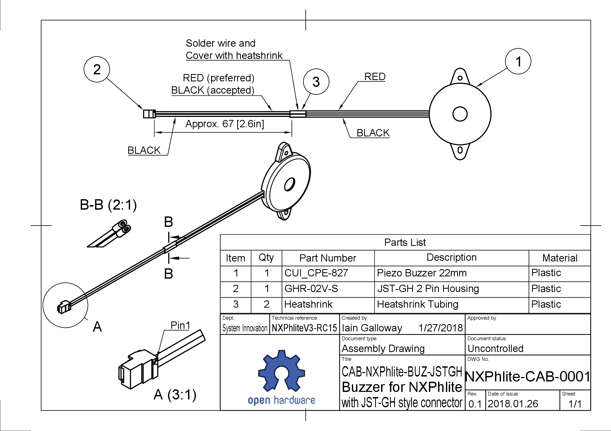

# Buzzer

Since RDDRONE-FMUK66 Rev. C, this connector is not found on the board anymore. The newer FMUs now have a [10 pin connector for the Pixhawk 4 GPS](gps.md), which has a buzzer inside. There is also no separate buzzer is included in the HoverGames kit anymore.


The 2 pin buzzer connector is **not found on newer versions** of the RDDRONE-FMUK66! The GPS module includes a buzzer. Please refer to the [GPS connector page](gps.md).


## Connector pinout

| Pin | Signal | Voltage |
| :--- | :--- | :--- |
| 1 | BUZZER- | +5.0V |
| 2 | BUZZER+ | +5.0V |

## Schematic

## Building the buzzer

* This is a piezo buzzer attached to a two pin JST-GH type connector.
* Polarity is not critical.

The buzzer cable looks like the image above when completed.

It can be made quickly:

* 1x 2 pin JST-GH housing.
* 1x 6" JST-GH pre-terminated wire.
* 1x Piezo buzzer.
* Cut the 6" JST-GH pre-terminated wire in half.
* Strip 5mm off the cut ends of the JST-GH wire you just cut in half, and add tin using a soldering iron. 
* Solder the JST-GH wire to the stripped and tinned Buzzer wires.
* Apply heatshrink over each of the solder joints.
* Poke the crimped end of the JST-GH wire into the two pin housing.
* The order does not matter, but for consistency the red buzzer wire should go to pin 1.

## Assembly drawing

