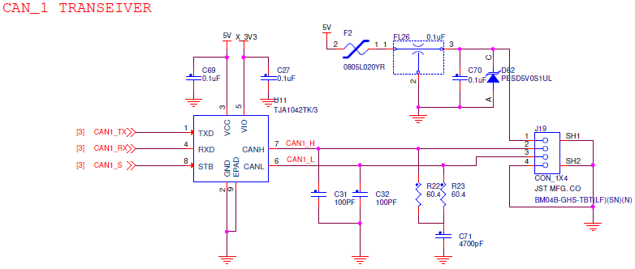

# CAN transceivers

The RDDRONE-FMUK66 features two [CAN (Controller Area Network) busses](https://en.wikipedia.org/wiki/CAN\_bus). PX4 implements the [UAVCAN protocol](https://en.wikipedia.org/wiki/UAVCAN), and supports some motor controllers, sensors and GPS solutions with a CAN interface. The current HoverGames kit does not include any hardware with a CAN interface, except the FMU itself.



## Connector pinout

| Pin | Signal | Voltage |
| --- | ------ | ------- |
| 1   | VCC    | +5.0V   |
| 2   | CAN H  | +3.3V   |
| 3   | CAN L  | +3.3V   |
| 4   | GND    | GND     |

## RDDRONE-FMUK66 Rev. C schematics

## RDDRONE-FMUK66 Rev. B schematic


Rev. B (and older boards) are **not supported** anymore. This information is left for reference.


 (1).PNG>)
