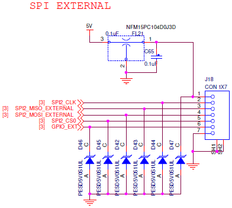

# External SPI bus

## Connector pinout

| Pin | Signal   | Voltage |
| --- | -------- | ------- |
| 1   | VCC      | +5.0V   |
| 2   | SPI CLK  | +3.3V   |
| 3   | SPI MISO | +3.3V   |
| 4   | SPI MOSI | +3.3V   |
| 5   | SPI CS   | +3.3V   |
| 6   | GPIO EXT | +3.3V   |
| 7   | GND      | GND     |

## RDDRONE-FMUK66 Rev. C schematic

## RDDRONE-FMUK66 Rev. B schematic


Rev. B (and older boards) are **not supported** anymore. This information is left for reference.


.PNG>)
