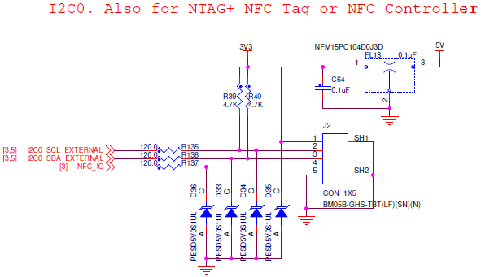

# External I2C bus / NFC

## Connector pinout

| Pin | Signal | Voltage |
| :--- | :--- | :--- |
| 1 | VCC | +5.0V |
| 2 | I2C SCL | +3.3V |
| 3 | I2C SDA | +3.3V |
| 4 | NFC IO | +3.3V |
| 5 | GND | GND |

## RDDRONE-FMUK66 Rev. C schematic

## RDDRONE-FMUK66 Rev. B schematic


Rev. B \(and older boards\) are **not supported** anymore. This information is left for reference.


