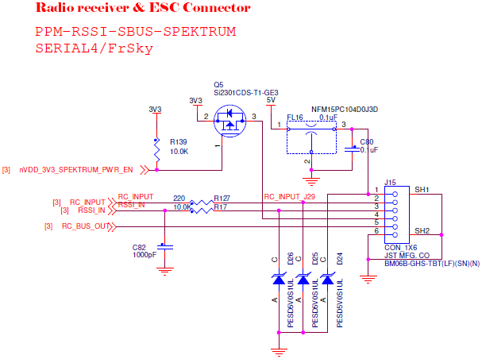

# RC input

RDDRONE-FMUK66 Rev. C has a single RC input connector. It has PPM/SBUS, RSSI and Spektrum inputs, and a RC output that together with the PPM/SBUS input forms a UART TX/RX pair.

RDDRONE-FMUK66 Rev. B and older revisions had two connectors for input from the radio controller. The FRSKY port supports PPM and SBUS inputs and has telemetry output for an FrSky radio controller. The other connector, labelled RSSI/PPM, supports PPM, SBUS and Spektrum radio protocols. This port also has an RSSI input. FrSky telemetry is impossible when the PPM/SBUS input on either connector is also used. 





## RDDRONE-FMUK66 Rev. C RC input connector pinout

| Pin | Signal | Voltage |
| :--- | :--- | :--- |
| 1 | VCC | +5.0V |
| 2 | RC IN \(PPM/SBUS\) | +3.3V |
| 3 | RSSI IN | +3.3V |
| 4 | SPEKTRUM IN | +3.3V |
| 5 | RC OUT | +3.3V |
| 6 | GND | GND |

## RDDRONE-FMUK66 Rev. C schematic

## RDDRONE-FMUK66 Rev. B FRSKY connector pinout


Rev. B \(and older boards\) are **not supported** anymore. This information is left for reference.


| Pin | Signal | Voltage |
| :--- | :--- | :--- |
| 1 | VCC | +5.0V |
| 2 | RC OUT \(TELEM\) | +3.3V |
| 3 | RC IN \(PPM/SBUS\) | +3.3V |
| 4 | GND | GND |

## RDDRONE-FMUK66 Rev. B FRSKY RC IN/RSSI connector pinout

| Pin | Signal | Voltage |
| :--- | :--- | :--- |
| 1 | VCC | +5.0V |
| 2 | RC IN \(PPM/SBUS\) | +3.3V |
| 3 | RSSI IN | +3.3V |
| 4 | SPEKTRUM IN | +3.3V |
| 5 | GND | GND |

## RDDRONE-FMUK66 Rev. B schematic

