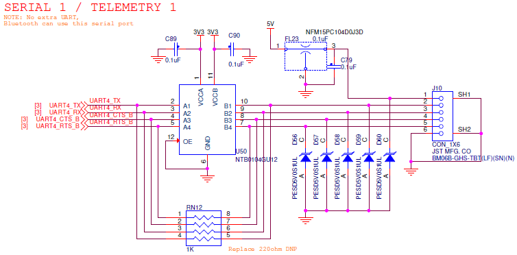

# Serial 1 / Telemetry 1

The serial port can be used to communicate with the FMU either remotely or with a companion computer on the drone itself. Often telemetry radios are connected to this port to provide a wireless connection with a ground control station. By default, PX4 listens and communicates using the [MAVLink protocol](https://en.wikipedia.org/wiki/MAVLink) on this port.

## Serial 1 / Telemetry 1 / (UART 4) connector pinout

| Pin | Signal   | Voltage |
| --- | -------- | ------- |
| 1   | VCC      | +5.0V   |
| 2   | UART TX  | +3.3V   |
| 3   | UART RX  | +3.3V   |
| 4   | UART CTS | +3.3V   |
| 5   | UART RTS | +3.3V   |
| 6   | GND      | GND     |


The labeling of RX and TX is inconsistent on some radios. Typically RX on the FMU connects to the TX from the radio. Check your cable and radio! Often the cable that comes with the radio set is wired correctly, even if the labeling is wrong.


## RDDRONE-FMUK66 Rev. C schematic

## RDDRONE-FMUK66 Rev. B schematic


Rev. B (and older boards) are **not supported** anymore. This information is left for reference.


.PNG>)

## Telemetry






Telemetry radio sets usually have different versions. The 433 MHz version is used in Europe, while 915 MHz is used in the USA. Make sure you have the right version for your location.

