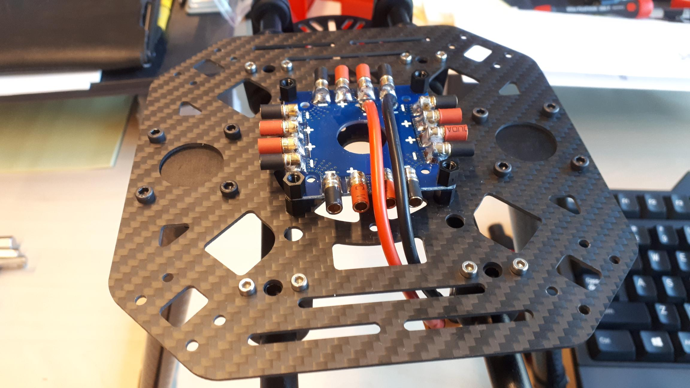
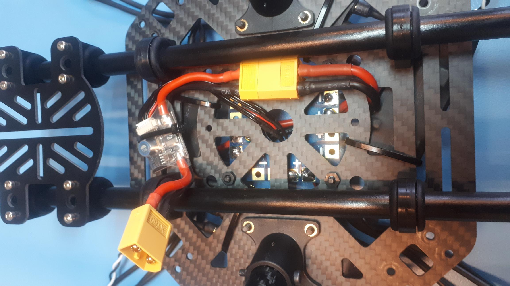
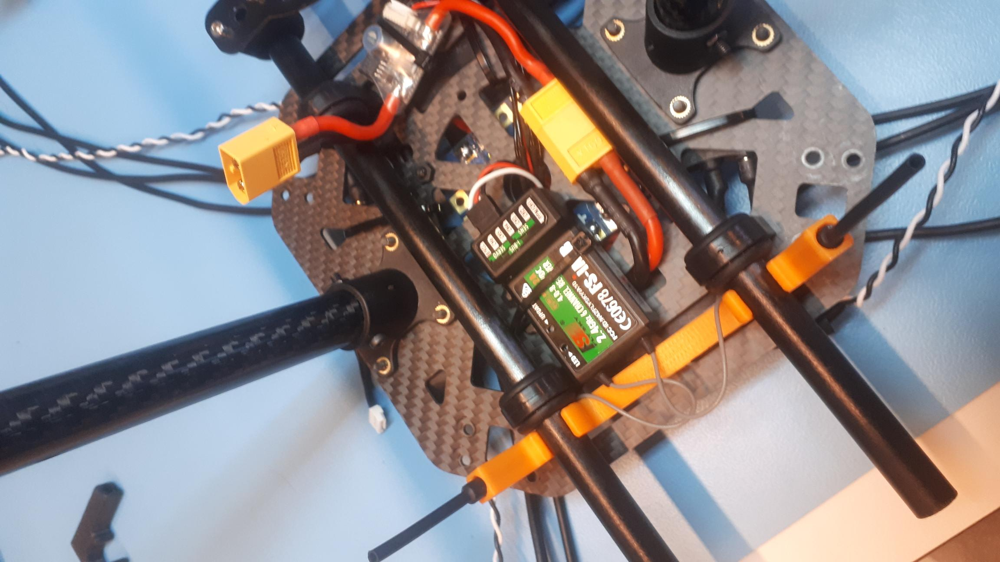
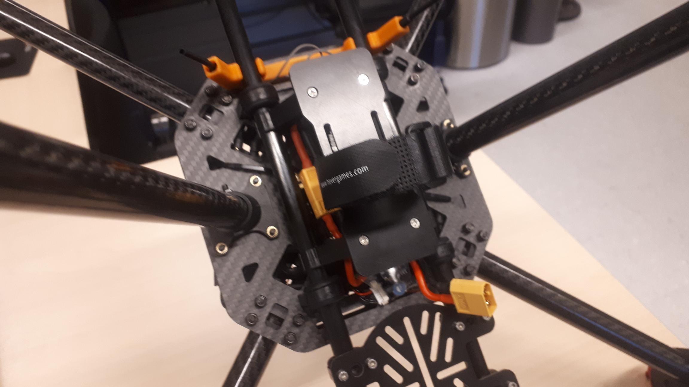

# ESCs, FMU power module and RC receiver

## Mounting the ESCs

Before we continue, you should put the yellow XT60 connector through the hole closest to what will be the back of the drone. See the picture below.

The ESCs should come with pre-soldered bullet connectors on the red and black leads. Also, there should be four sets of three extension cables included, which go between the ESCs and the motors. Plug these extension cables into the ESCs first, if you didn't already plug them into the motors. In that case, you can connect them to the ESCs later when we install the arms onto the body of the frame.



Then, plug the red and black wires into the PDB and use some zipties to strap the ESCs to the bottom plate. You could also use the double sided foam tape / sticky pads. You can see four screws for mounting the arms in each corner, make sure you do not cover them with the ESCs.

You should install the ESCs in a similar way to what is shown in the picture below. This should still give you enough space to plug in the connectors.


The video above shows a slightly different distribution of the ESCs around the PDB. We believe this method is easier than the distribution shown below. We will adapt the written instructions and pictures soon. Please use the method as shown in the video for now.


## FMU power module

The yellow XT60 connector coming from the PDB is now coming out at the bottom of the frame. You can plug the FMU power module \(with black or yellow XT60 connectors\) into this connector. Use a zip tie to strap the power module to the bottom of the frame. You should be able to use some of the slits at the front for this. When we are finished, the battery will be plugged into the other end of the power module.

Make sure to put the 6 pin JST-GH connector coming from the power module through the hole in the middle. We will plug this into the FMU \(which will go on top\) later. This cable will provide power to the FMU as well as voltage and current sensor data.



## RC receiver module

We will also mount the RC receiver module on the bottom. The receiver for the radio controller has two antennas that work best when under an angle. A 3D printed antenna mount is included in the kit. The antennas should fit right into it and can be attached to the rails.


If the antennas do not fit in the 3D printed mount, you might need to drill the holes in the mount slightly. Scraping off some of the 3D printed plastic on the inside with a screwdriver or sharp object also works.


A small cable with a 6 pin JST-GH connector one one side and a 3 pin servo connector on the other side should be plugged into the receiver module. The pins are labeled `i-BUS SERVO` on the receiver. The signal wire \(white\) should be on the outside. See the picture below.



The antenna mount can be easily attached to the rails at the bottom of the drone. You can always move it over the small carbon tubes if the antennas are blocking a screw or nut.

You can fix the receiver module itself with a zip tie or some double sided foam tape/pads. Just like the cable coming from the power module, put the cable with JST-GH connector through the hole in the middle. This cable will plug into the FMU as well.

## Battery plate

We have installed everything on the bottom of the drone, except for the battery plate. It consists of a carbon plate with two clamps that are put together with four small screws. It is easiest to put the clamps onto the rails first, then screw the carbon plate onto them. A velcro strap is included to keep the battery in place.


The screws that go into the battery plate could really use some **threadlocking adhesive** \(e.g. Loctite 243\). Also check these screws often! You don't want to lose your battery during flight.


