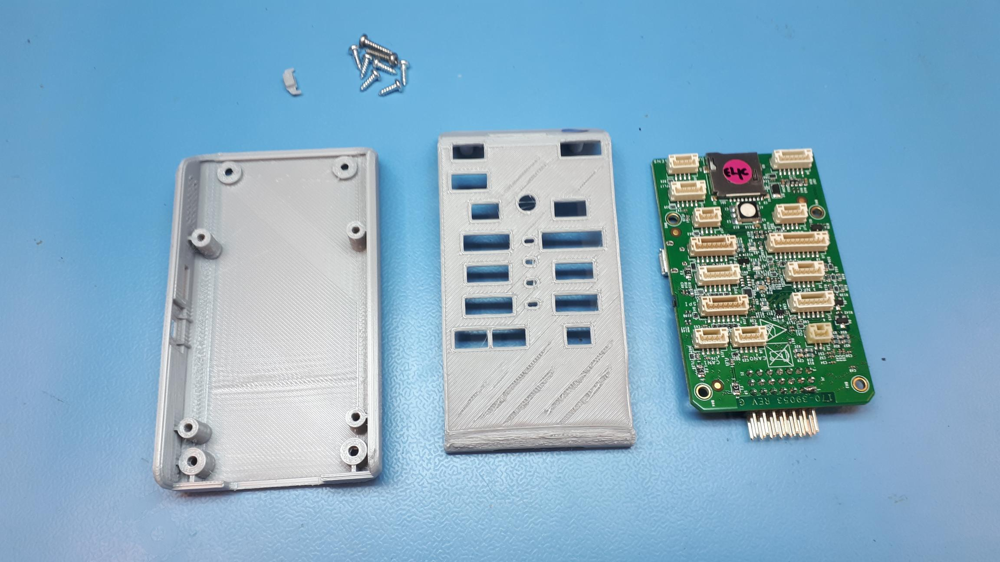
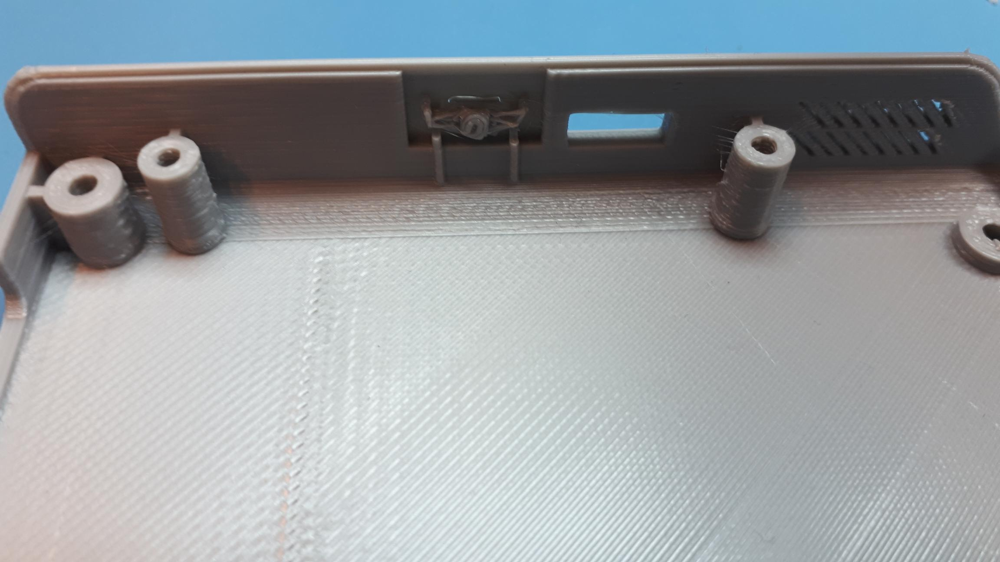
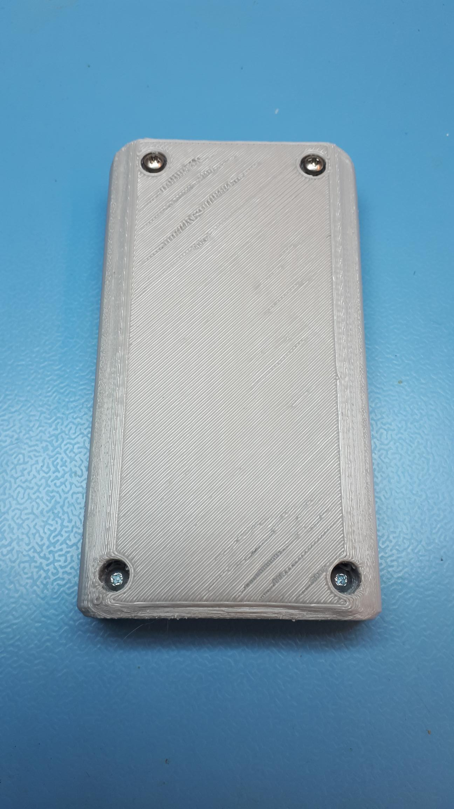

# FMU enclosure

The FMU comes with a 3D printed enclosure, which still has to be assembled. It consists of a top part, a bottom part and a tiny reset button.   


Slight warping of the plastic during storage may be easily corrected by running the enclosure under warm tap water and bending back into shape by hand. 



You may find the FMU board still has Kapton tape covering the top of the connectors. \(They look like translucent yellow orange stickers\) You should remove this protective tape before installing the FMU inside the enclosure.



You may notice that **two pins on the PWM servo-rail of the FMU are shorted with solder**. This is intentional and ensures that the rightmost GND pin on the PWM servo-rail is correctly connected to the PCB ground. Both pins are GND signal.   
This is adjusted on "FMUK66E" and later boards, but it is completely fine if you see these two pins connected together on your board.




First, make sure the reset button is installed inside the enclosure. It should fit in a hole in the side, next to the hole for the micro USB connector.

Now, the FMU can be installed into the bottom part of the enclosure with four short screws \(7 mm\). You may only have one type of screw with your case, which is fine as well. Just use four of the included screws and be gentle when tightening them into the plastic. Do not overtighten.

After the FMU is installed and screwed down to the bottom part, you can put the top part of the case in place and turn the whole enclosure upside down. You need two short screws \(7 mm\) and two longer screws \(about 10 mm\) to keep the two halves together. The short screws should go in the holes close to the servo-rail of the FMU. The longer ones go in the holes near the SD card slot. Again, if you have only one type of screw with your case, that is fine as well. Just be gentle when tightening the screws.


Once the FMU is inside the enclosure, you should **insert the microSD card**! Flight log data will be kept on this SD card and it contains very useful information for analyzing flight performance. It's also a very nice tool when you are having issues, the logs provide detailed data about what is going on.

  
In normal operation the FMU may generate an error and/or refuse to arm without the SDCARD in place.


