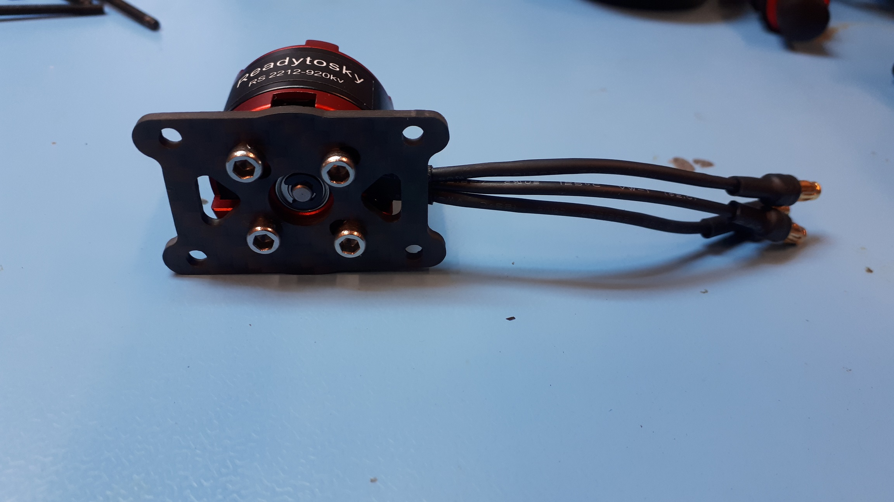
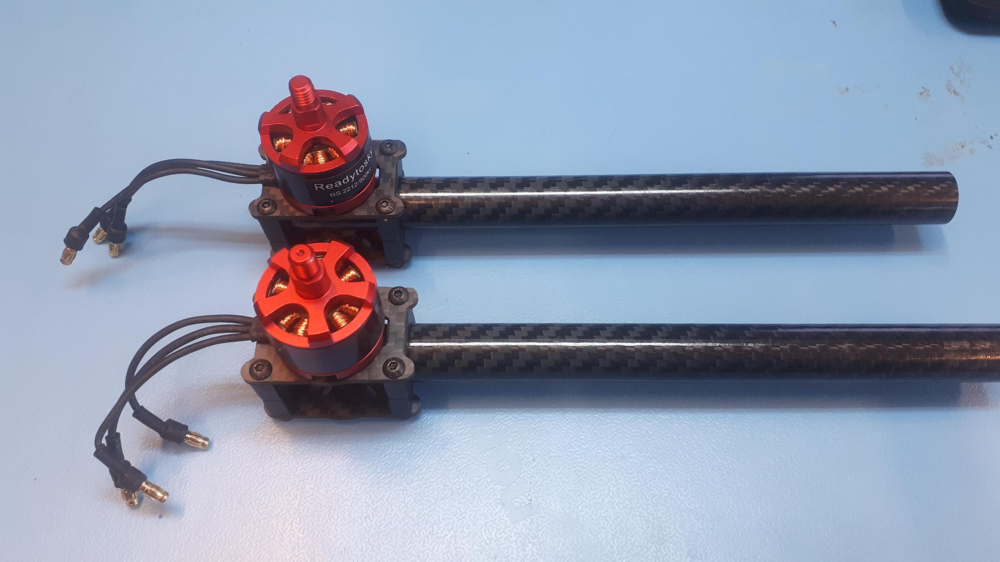

# Preparing the arms and motors

## Motor mounts

The four motor mounts go on the end of the arms \(carbon fiber tubes\). Each one consists of two small carbon fiber plates, four tube clamps \(the arch-shaped parts\), and four long M2.5 screws with locknuts \(with an elastic ring inside\). Additionally, you need the motor itself and four short M3 screws from the labeled bag.




For the motors, make sure that you are using the +/- 5 mm long **silver M3 screws from the separate package with the label** saying to use these screws for mounting the motors.  
  
**Do not use the longer M3 screws included with the frame**, these screws may go in too deep and can damage the motor windings. The **black screws** included with the motors **might be safe to use**, but be careful.


The first step is to mount the motors onto the carbon plates. You need a carbon plate and four M3 screws for this. Make sure the three motor wires come out on one of the short sides of the carbon fiber plate. Repeat this step until you have all four motors mounted. Make sure you tighten the screws appropriately, because it will be hard to access the screws later.


Consider using a **threadlocking adhesive** such as Loctite 243. This will make sure that the motor mount screws don't get loose because of the vibrations in the drone frame. At the very least, check them regularly to make sure that there aren't any loose screws.

Note that these are one of the few cases where this could be beneficial, since most screws have locking nuts and are not really affected as much by the vibrations.


For the next step, we need four tube clamps, the other carbon plate, four long M2.5 screws and the locknuts. The screws go through the holes in the corners of the carbon fiber plate. Then on each side two tube clamps are added onto the screws. The carbon fiber arms will fit between these clamps. Finally, the carbon fiber plate goes over the screws and a locknut goes on the end. Tighten the nuts slightly by hand, so they don't fall of. You don't have to fully tighten them with a wrench yet, because we have to put the carbon fiber tubes through first, and then we will tighten it around the tube.



### Alternative approach

There are two ways to assemble the motor mounts. Having the screws come down from the top, with the locknuts on the bottom makes most sense, because you will probably only lose the nut when it comes loose during flight. However, it can be convenient to put the screws up from the bottom. In this case, you put the screws through the "bottom plate" first, with the tube clamps going on top. You can then put this structure on the table and put the plate with motor on top of it. 

This makes serviceability a bit easier, which is nice if you are building multiple drones kits, or when you have to take them apart often. This is especially useful for the middle part of the drone, which is build in a similar way as these motor mounts. The disadvantage is that you are likely to lose both the screw and the nut in case it comes loose. Ultimately, it comes down to preference.



## Inserting the carbon fiber tubes

You can now insert the carbon fiber tubes between the tube clamps. The motor mounts should be on the end of the tube. The tube should **extend slightly beyond the motor mount**, but a few millimeters should be enough. The motor wires should be on the opposite side of the carbon fiber tubes. These wires will later plug into extension cables that will come from inside the carbon tubes. Once the tube is inserted, you can tighten the screws using a hex key and a wrench.


This guide will instruct you to put the ESCs inside the drone frame. Extension cables are provided for this. It looks a lot cleaner. However, it is also possible to put the ESCs on the arms. This is a bit easier to do, but doesn't look as nice. You can also experiment with other configurations, such as putting the ESCs underneath the motor mounts.


If you look carefully, you can see that two motors have a notch on top of the shaft. The other two motors have a flat top. This is an indication of the direction in which the motor is supposed to rotate, and the threading on the shaft corresponds to this. 

We will come back to this later. Just keep in mind that there are motors that are supposed to rotate clockwise, and motors that should rotate counter clockwise.

## Motor extension wires

You can choose to insert the extension wires into the tubes already. These wires will plug into the ESCs \(electronic speed controllers\) that we will put inside the center of the drone frame in a later part.



