# Top plate, GPS, telemetry and FMU

## Vibration damped FMU mount

First the FMU mount should be put together. It's a small carbon fiber part and it should come with four black vibration damping rubbers. You should put these rubbers through big holes in the corners of the carbon, as shown below.

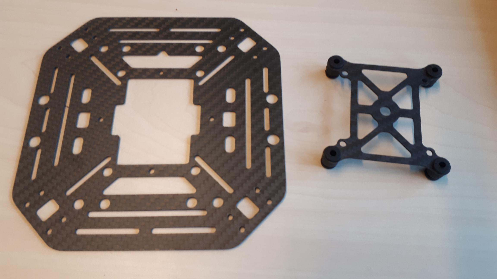

There are four similar holes at the corners of the big gap in the middle of the top plate. You should also put the rubbers through these holes, as shown below. Note that they do not exactly align, there will be some tension on the rubbers. This will help dampen the vibrations.



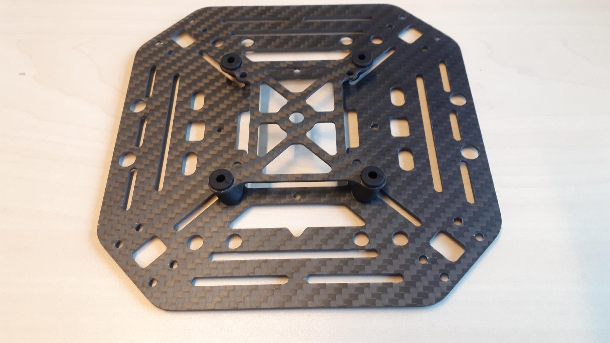

## Installing the GPS

The GPS and its mount consist of several parts. The GPS should come with a **short** and a **long** rod. We **recommend to use the shorter one**, because it won't vibrate as much as the longer rod. However, many successful tests were done with the long one as well, so ultimately it comes down to personal preference. The longer one is useful when you get too much interference from the other electronics on the drone.


You will need a 1.5 mm hex/Allen key for the very small screws that keep the rod in place. There are 2.0 and 2.55 mm hex keys included in the kit, but not 1.5 mm! \(Recent kits that include a hexdriver set that should work\)  
  
Also, some GPS mounts have a Phillips/Pozidriv screw instead of 2.5 mm hex screw. You might need an additional screwdriver for this as well.




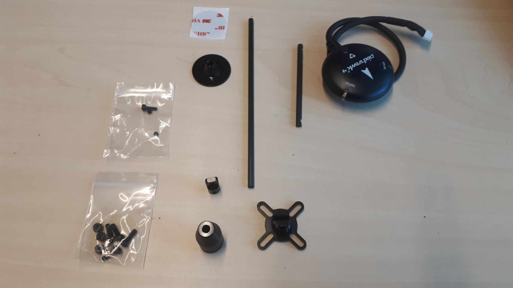

A small part that will hold the rod should be screwed onto the cross-shaped base, using a hex screw. 

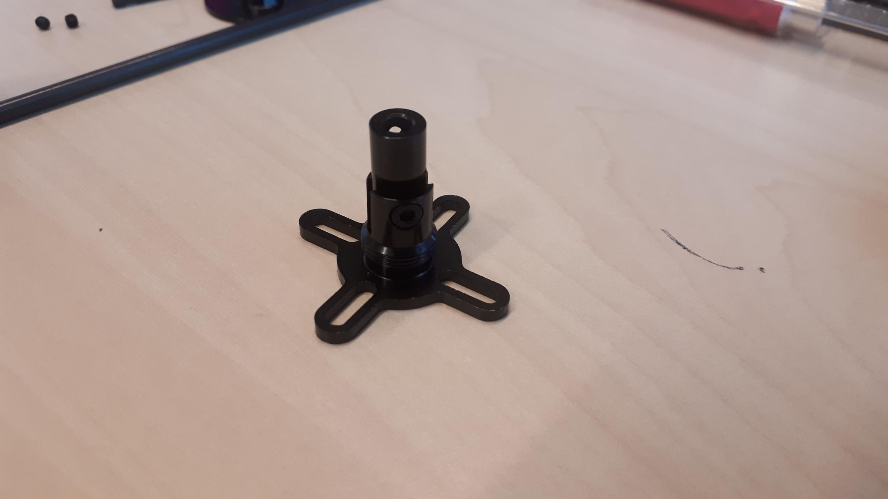

The rod can be inserted into this piece and will be kept in place with a tiny hex screw.

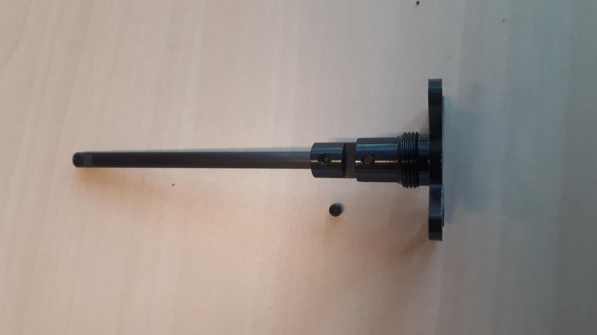

You should put the big "cone" over the rod, you can screw this onto the base.


The  "cone" may feel tight when screwing down. Some people have found that they need to file the edge of the head of the tilt-hinge screw to improve this situation.


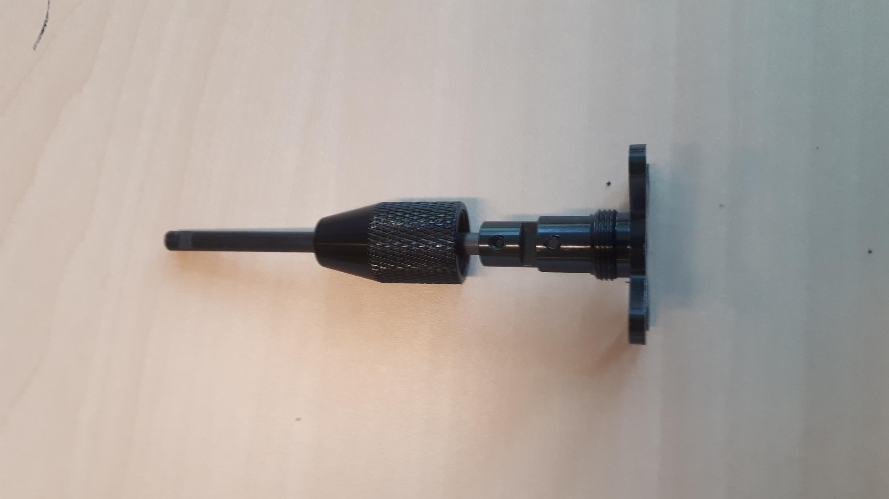

On top, you should have a big flat piece, which is also kept in place with a tiny hex screw.

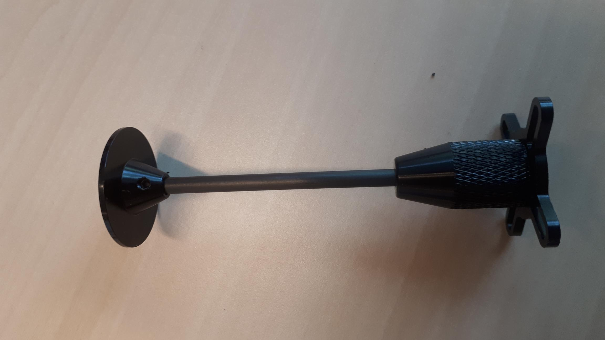

With the included double sided tape, you can install the GPS itself on top. Make sure the arrow on the GPS aligns with one of the "arms" of the cross-shaped base. It doesn't have to be perfect, you will be able to slightly rotate the GPS after loosening the small screw in the top part of the mount.


There may still be a bit of play in the GPS mast after the nut is tightened. You can improve this by adding a bit of clear tape around the hole where the mast enters the 'cone', or by adding some tape under the cone itself.  
  
Alternatively you may want to check if the head of the screw on the tilt mechanism is sticking out a bit too far. Filing the edge of this screw head may allow the cone to tighten on a bit better. 


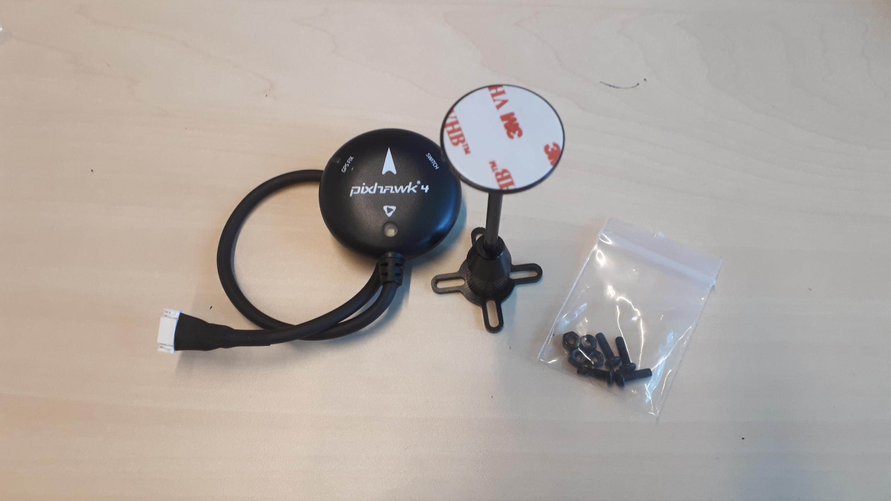

We also suggest to remove the piece of heatshrink \(or cloth tape\) at the end of the GPS cable, just before the connector. Be \*very\* careful to not cut the wires! The reason for this is that this heatshrink itself is quite stiff and in some cases this could cause mechanical vibrations in the GPS mount to be transmitted by the cable to the FMU.


It is also recommended to use small cable ties to hold it down to the top plate in order to further isolate the cable and mast from the FMU.


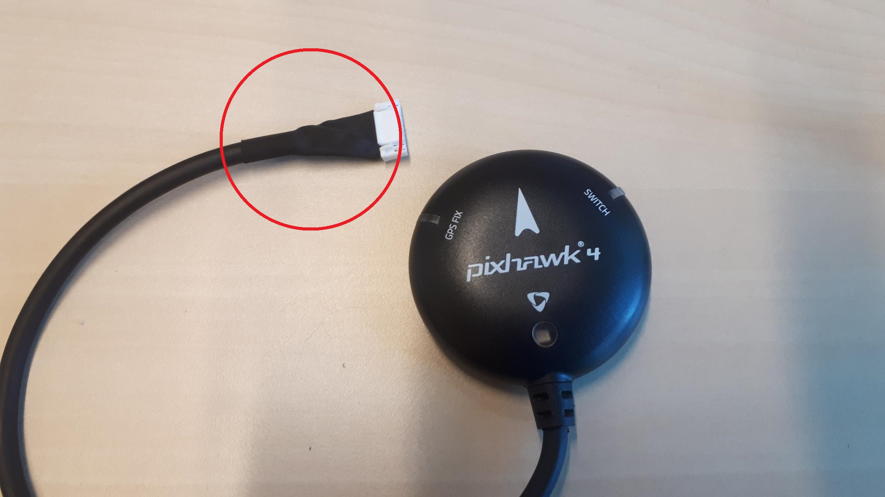

Once it's assembled, the GPS mount can be installed onto the top plate. It's easier to do this now, because you can easily access the bottom side of this plate. 

Earlier, on the bottom plate, we defined the front as the side pointed to by the weirdly shaped gap in the plate. The gap with the little notch or triangle. We will also use this to define front for the top plate. We will install the GPS on the right side of the plate, and the arrow on the GPS should point towards the front of the drone. Also see the picture below.

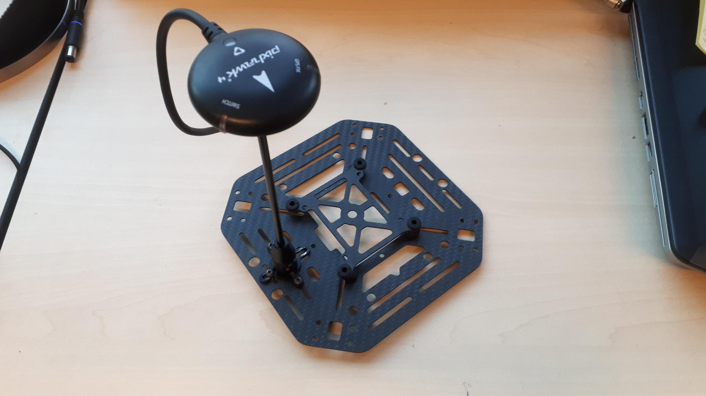



There should be screws and nuts included with the GPS. You can use the slits on the side of the plate to put the screws through. On some top plates there will be exact holes to mount to. We have used only three screws, which should be enough. If you put a washer in between, you might also be able to use the fourth screw. 


The GPS module consists of a **GPS receiver** and a **magnetometer** \(compass\). There are also a few LEDs on the module: a RGB status led, a small GPS fix led which indicates if the GPS reception is good enough, and a switch LED which can be pressed and acts as a **safety switch for arming** your drone.


### Arming switch integral to GPS module


Note the GPS module serves multiple purposes. There is an ARMING SWITCH as part of the light-up "ARMED" LED that needs to be pressed before flight.


## Telemetry radio

The telemetry radio can be installed on the left side of the plate \(the opposite side of the GPS\). Use a ziptie or some double sided foam tape. Make sure both the JST-GH and Micro USB connectors remain easily accessible. You will use the JST-GH to connect the radio to the FMU, and you might need the micro USB to connect it to your computer to update the radio firmware.

Be careful that you don't cover the screw holes for the arms with the telemetry radio or its antenna. There are four in each corner of the plate.



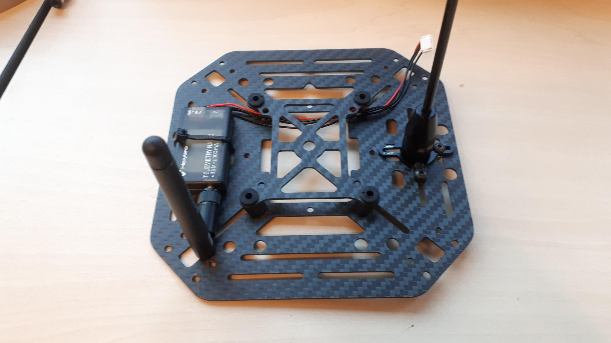

## Mounting the FMU

You can mount the FMU with some sticky pads. Later, we will plug in all the wires and use some zip ties to secure them.

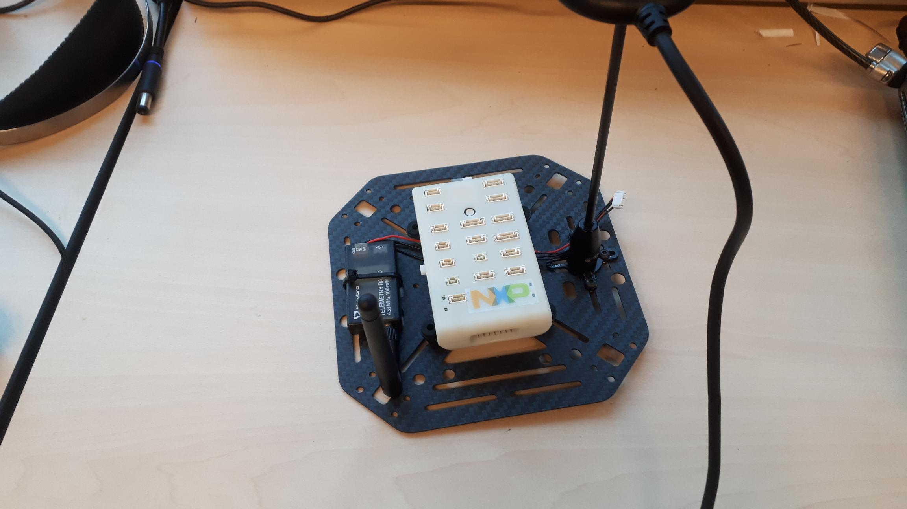

