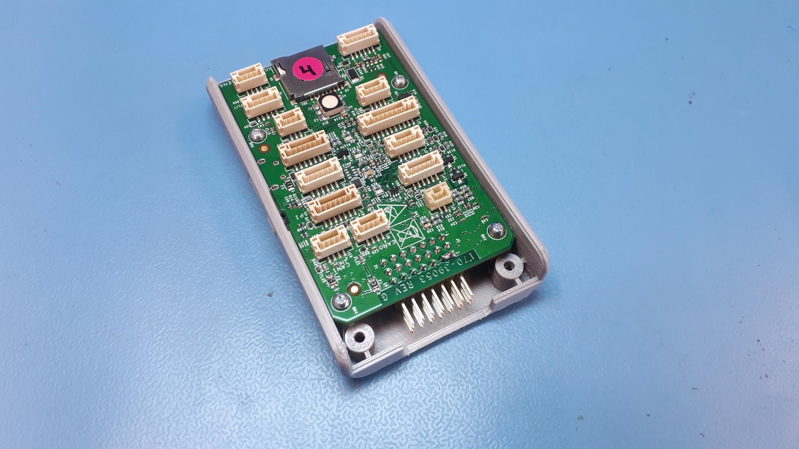
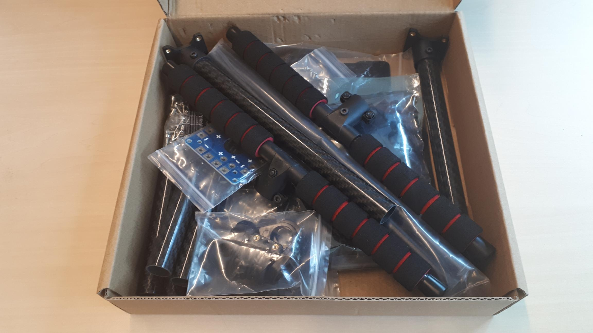
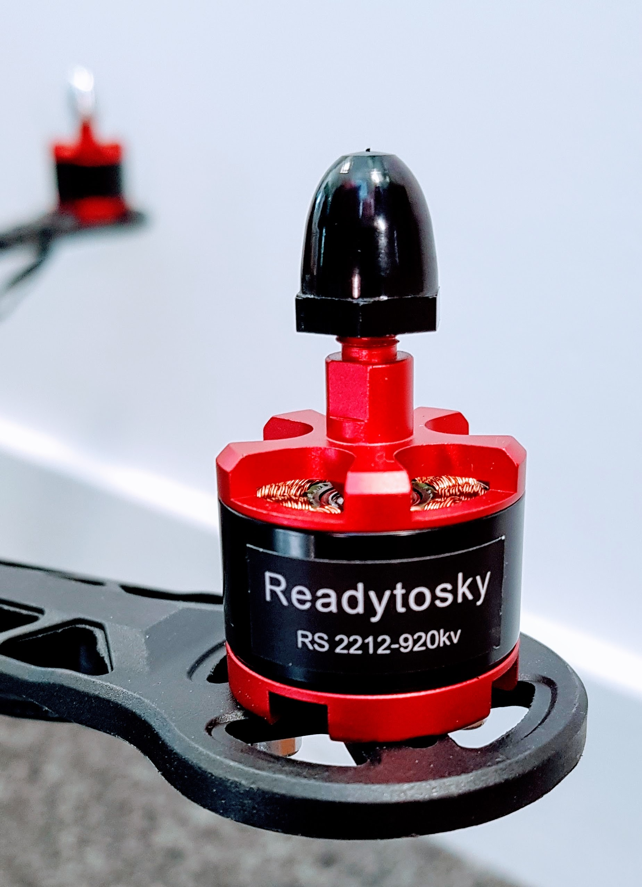
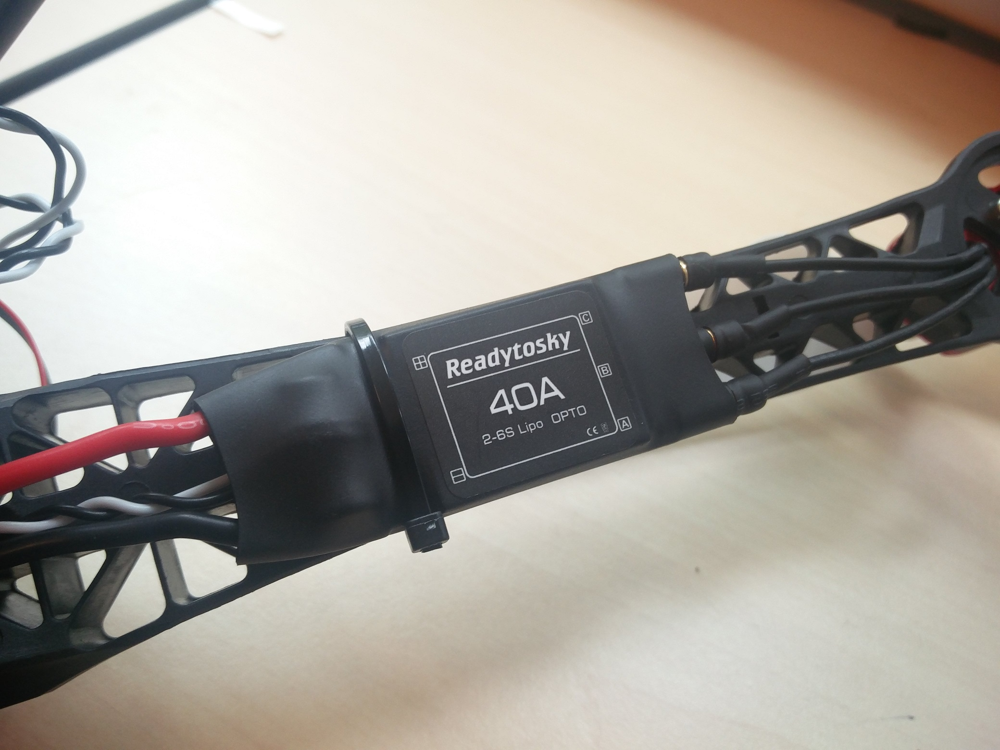
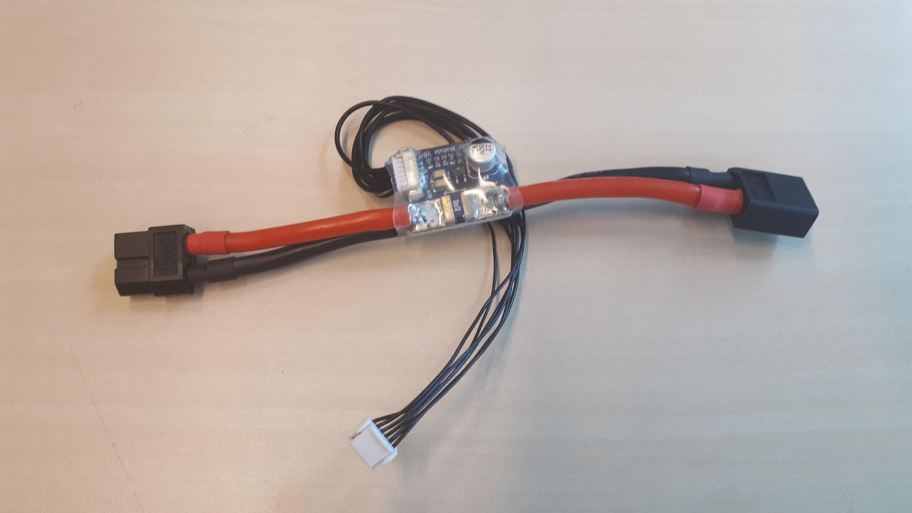
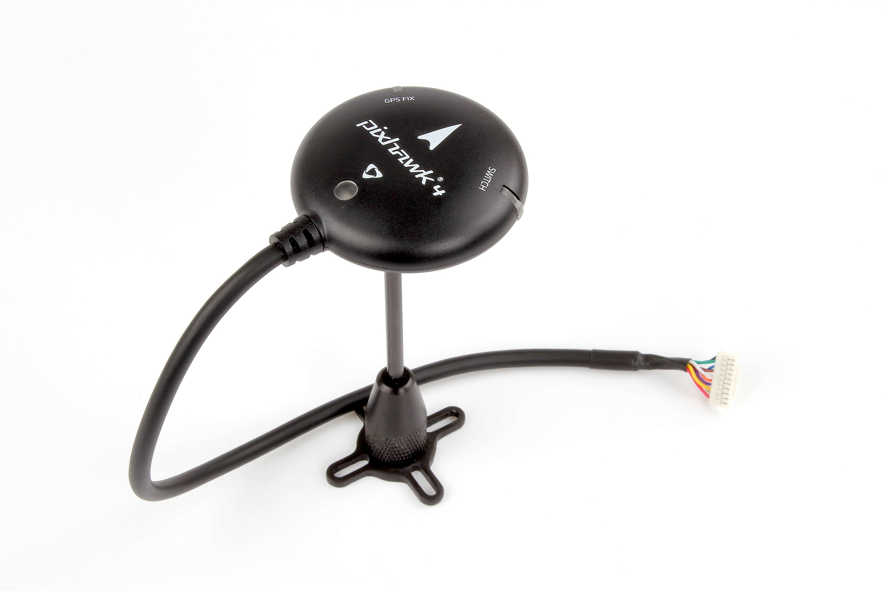
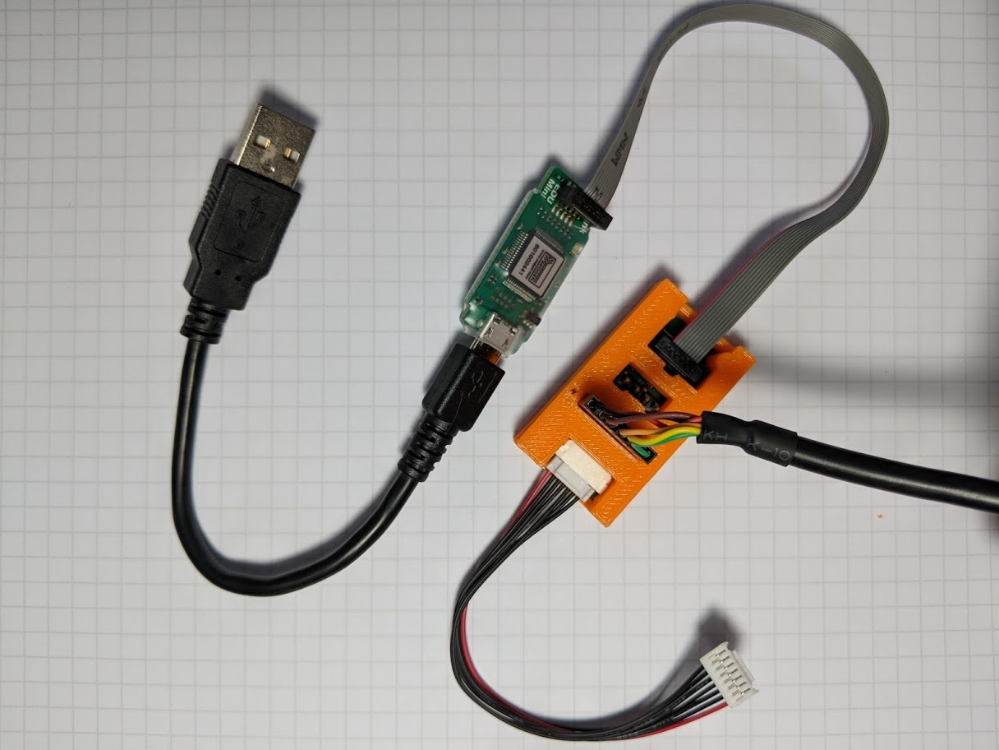

# Drone kit contents

The HoverGames drone kit includes most components required to build your own quadcopter. The kit provides a frame, motors, electronic speed controllers, the RDDRONE-FMUK66 flight controller and some additional peripherals. The contents of the package should be checked to make sure nothing is missing.


Sorry - Some required parts **cannot be included** in the HoverGames drone kit because of shipping regulations. **LiPo batteries** and some other small items are [listed on a separate page](not-included-items.md). They have **to be bought separately** before you are able to fly.


 

## Overview of the included items

* 1x [NXP RDDRONE-FMUK66 with enclosure and microSD card](drone-kit-contents.md#nxp-rddrone-fmuk66-with-enclosure-and-microsd-card)
* 1x [ReadytoSky LJI X4 500 quadcopter frame kit with carbon fiber landing gear](drone-kit-contents.md#readytosky-lji-x4-500-quadcopter-frame-kit-with-carbon-fiber-landing-gear)
* 4x [ReadytoSky RS2212 920 kV CW & CCW brushless motor](drone-kit-contents.md#readytosky-rs2212-920-kv-cw-and-ccw-brushless-motors)
* 4x [ReadytoSky 2-6S 40 A OPTO ESC](drone-kit-contents.md#readytosky-2-6-s-40-a-opto-escs)
* 12x Extension cable with bullet connectors 
* 4x [LJI 9450 propellers CW & CCW](drone-kit-contents.md#lji-9450-self-locking-propellers-cw-and-ccw)
* 1x [FMU power module](drone-kit-contents.md#fmu-power-module)
* 1x [Holybro Pixhawk 4 GPS](drone-kit-contents.md#holybro-pixhawk-4-gps) with integrated safety switch and buzzer
* 1x [FlySky FS-i6S radio control transmitter and FS-iA6B receiver](drone-kit-contents.md#flysky-fs-i-6-s-radio-control-transmitter-and-fs-ia-6-b-receiver)
* 1x 3D printed RC receiver antenna mount
* 1x [Debug breakout board with cable](drone-kit-contents.md#segger-j-link-edu-mini-usb-ttl-3-v3-cable-debug-breakout-board-with-cable) and 3D printed enclosure
* 1x [Segger J-Link EDU Mini](drone-kit-contents.md#segger-j-link-edu-mini-usb-ttl-3-v3-cable-debug-breakout-board-with-cable) debugger
* 1x [Generic USB-TTL-3V3 cable](drone-kit-contents.md#segger-j-link-edu-mini-usb-ttl-3-v3-cable-debug-breakout-board-with-cable)
* 1x HoverGames battery strap
* 1x HotRC A400 3S-4S LiPo battery charger, with EU & US power plugs \(**BATTERY NOT INCLUDED!**\)
* Hex/Allen keys and wrench
* Extra cables with JST-GH connector
* Double-sided foam tape / sticky pads
* Zip ties


Micro USB cables are included with the [radio controller](drone-kit-contents.md#flysky-fs-i-6-s-radio-control-transmitter-and-fs-ia-6-b-receiver) and the [telemetry radio sets](not-included-items.md#holybro-radio-v3-telemetry-radio-transceiver-set). Note that the telemetry radio sets are sold separately, they are [not included](not-included-items.md#holybro-radio-v3-telemetry-radio-transceiver-set) in the HoverGames drone kit!


## NXP RDDRONE-FMUK66 with enclosure and microSD card

* [Product webpage](https://www.nxp.com/support/developer-resources/nxp-designs/rddrone-fmuk66-px4-robotic-drone-fmu-reference-design:RDDRONE-FMUK66)

The NXP RDDRONE-FMUK66 flight management unit is the brain of the HoverGames drone. It features NXP sensors and automotive grade components and it is fully supported by [PX4 Autopilot software](https://docs.px4.io/en/). This GitBook provides instructions and external sources which should help you set up the software.

The FMU comes with a 3D printed enclosure, which can be mounted on top of the drone with double-sided tape. A microSD card is also included, to which [logs](https://dev.px4.io/en/log/flight_log_analysis.html) will be written [during flight](../flying/during-flight.md). Make sure to insert this SD card [before you fly](../flying/before-you-fly.md)!

## ReadytoSky LJI X4 500 quadcopter frame kit with carbon fiber landing gear

* [Product webpage](https://www.aliexpress.com/store/product/X4-500-500mm-Carbon-fiber-Glass-Fiber-Center-Plate-Quadcopter-Frame-kit-Carbon-Fiber-Landing-Gear/727847_32952518324.html)

The LJI X4 500 quadcopter frame is the body of the HoverGames drone. It replaces the S500 frame that was included with older kits. It is completely made out of carbon fiber parts and has a vibration damped mount for the FMU. This GitBook provides instructions on how to assemble this frame.

* Frame size: 500 mm \(diagonal\), 200 mm \(height\)
* Weight: 475 g \(without electronics and motors\)


Be careful with the carbon fiber parts of the frame. The edges may be sharp.


## ReadytoSky RS2212 920 kV CW & CCW brushless motors

* [Product webpage](http://www.readytosky.com/e_productshow/?787-RS2212-920KV-CW&CCW-Brushless-Motor-787.html)

The kit includes four brushless motors suitable for a quadcopter the size of the HoverGames drone. Two motors will rotate in clockwise \(**CW**\) direction, and two in counter clockwise \(**CCW**\) direction. This allows the drone to fly stable without unwantedly rotating around its vertical axis.

The clockwise \(**CW**\) rotating motors have a little notch on top of their shaft. It might come with a black nut. The counterclockwise \(**CCW**\) rotating motors have a smooth top and they usually come with silver nuts.


Make sure to use the right nuts with the right motors! You could **damage the threading** on the motor shafts or the nuts if you force a nut with the wrong threading onto the shaft. 

Note that the nuts might also be "integrated" into the propellers. The propellers included in the HoverGames kit should be of this "self-locking" type.



Direction of rotation matters when mounting the motors on the frame. This will be extensively discussed in other parts of this GitBook. Make sure to not miss any steps of the assembly instructions.


## ReadytoSky 2-6S 40 A OPTO ESCs

* [Product webpage](http://www.readytosky.com/e_productshow/?301-Readytosky-2-6S-40A-Electronic-Speed-Controller-301.html)

There are four ESCs \(electronic speed controllers\) or motor controllers included in the HoverGames kit. The ESCs control the current to the motors on demand of the FMU. The motors are connected to the ESCs with three bullet connectors. It is safe to connect these three connectors in any order.


The **three bullet connectors** can be connected in **any order**. However, when a motor does not turn in the desired direction, two of the three cables should be **swapped**. The motor will then turn into the **opposite** direction. We will come back to this during the assembly instructions.


The provided ESCs are able to handle currents up to 40 A continuously, which should be more than enough when used with the included motors. They support [battery configurations](not-included-items.md#lipo-batteries) between 2 and 6 cells in series \(3 or 4 cells are recommended\).

## LJI 9450 self-locking propellers CW & CCW

* [Product webpage](http://www.readytosky.com/e_productshow/?913-9450-2-blades-Self-Lock-Propeller-CWCCW-913.html)

Included in the kit are also two clockwise \(**CW**\) turning propellers and two counterclockwise \(**CCW**\) propellers. The intended direction of the propeller becomes clear from the shape of the propeller. Looking at it from the side, it curves down towards the back of the propeller blade, with the front being the side which "slices through the air first".

The direction of these self tightening propellers is also easily recognized by the color of the "integrated" nut. Propellers with a **black** nut are meant to go **clockwise**, and propellers with the **silver** nut go **counterclockwise**.

## FMU power module

* [Product webpage](http://www.readytosky.com/e_productshow/?531-APM-Power-Module-w-BEC-XT60-Plug-Connectors-531.html)

The power module provides power to the FMU and also includes voltage and current sensors which allow the flight controller to keep track of the battery level.

The small white JST-GH connector provides power to the FMU. The the big black XT60 connectors go to the batteries and the power distribution board \(PDB\). The PDB included with the frame kit should already have an XT60 connector installed. Note that XT60 connectors are often yellow.

## Holybro Pixhawk 4 GPS

* [Product webpage](http://www.holybro.com/product/pixhawk-4-gps-module/)

GPS allows the drone to receive information about its position. This enables position hold mode and autonomous flying modes in which no user input is required. The Pixhawk 4 GPS has an integrated safety switch, buzzer and status LED. It plugs directly into the FMU. It also includes a compass, which is able to measure the rotation of the drone. The GPS comes with its own mount as well.

## FlySky FS-i6S radio control transmitter and FS-iA6B receiver

* [Product webpage](https://www.flysky-cn.com/fsi6s)

For controlling the drone, a radio controller is included. The transmitter has several switches to which different actions and functions can be programmed. Settings are changed with a touchscreen, which can also be set up to show telemetry data. The receiver module connects directly to the FMU. A 3D printed component for mounting the antennas of the receiver is included in the drone kit.

More information on setting up the RC transmitter and receiver can be found elsewhere on in this GitBook.

## Segger J-Link EDU Mini / USB-TTL-3V3 cable / Debug breakout board with cable

Debug tools are also included in the HoverGames kit. It consists of a small breakout board with a 3D printed plastic case, a Segger J-Link EDU Mini debugger and a USB-TTL-3V3 cable, as well as a 7 pin JST-GH cable that connects the breakout board to the FMU. With this setup you can program a blank board, single step through the code, set breakpoints and debug the processor. The USB-TTL-3V3 cable gives you access to the [system console](../../devguide/system-console/).


The USB-TTL-3V3 cable has to be inserted into the 6 pin connector on the debug breakout board as shown below. The **black wire \(ground\)** has to be on the side with the small **notch/mark**. Doing it the wrong way around could damage your FMU or adapter board!


## 

