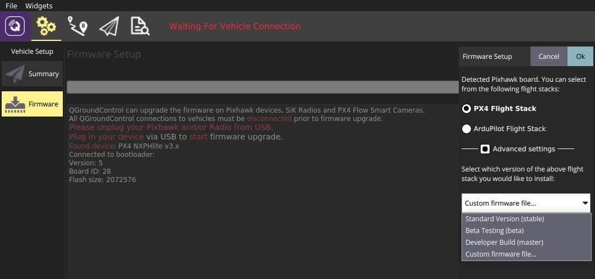

# Firmware

When a compatible bootloader is present on the target device, QGroundControl can update the firmware on it. You can use this feature to update the PX4 firmware on the RDDRONE-FMUK66, but also to update firmware on telemetry radio modules.

The QGroundControl user guide provides a clear description of the firmware uploading process. Please have a look at their documentation:



## Uploading PX4 firmware using QGroundControl

It is recommended to use PX4 on the RDDRONE-FMUK66. It's an opensource flight stack containing all the software necessary to get your drone into the air. PX4 is constantly being updated with stability improvements and new features. It is recommended to always run the latest \(stable\) firmware on your FMU, as constant updates will make your drone fly more stable, add exciting new features and open up more possibilities for using different sensor types. In the Firmware screen you can upload a new version of PX4.


You probably already [programmed the PX4 firmware after you programmed the bootloader](../programming.md#programming-the-firmware)! In that case you do not have to program firmware again. However, you can use this feature to upgrade to newer firmware versions when they become available.


QGroundControl will ask you to plug in your FMU using a USB cable. It might also ask you to first unplug it again, because it needs to enter the bootloader before it can upload firmware. A popup will appear that asks you which flight stack you want to use. We will use the PX4 flight stack. You can choose between the standard \(stable\) version and test/development versions, or a custom firmware binary. It is **recommended to use the stable version**, for now.

It is also possible to build the firmware yourself \(or [download binary files from the PX4 Continuous Integration server](http://ci.px4.io/job/PX4_misc/job/Firmware-compile/job/master/lastSuccessfulBuild/artifact/build/nxp_fmuk66-v3_default/)\), and upload it through the custom firmware option. Instructions for building your own firmware binaries from source are available in the developer guide:



## Updating the telemetry radio firmware

It is recommended to also update the firmware on your telemetry radios. Simply go to the Firmware tab in QGroundControl and plug in your radio using a USB cable. Make sure you only have the radio plugged in to your laptop, no FMU. QGC should automatically detect the radio and start the firmware upgrade process. If you get any errors during this process, starting over usually works.

You have to do this for both radios! If you don't, you might not be able to establish a connection. Make sure the radio on the drone is not connected to the FMU \(take out the JST-GH connector\) and connect it with a USB cable to your computer, just like the other radio.

